# rustboy-color — Architecture

A Game Boy Color emulator in Rust, targeting the browser (wasm32) and native
desktop (x86_64 + aarch64) from one emulation core.

> This document is written to be **read while building**. Each section explains
> the hardware in plain language first, then the design that models it.

---

## 1. Crate layout

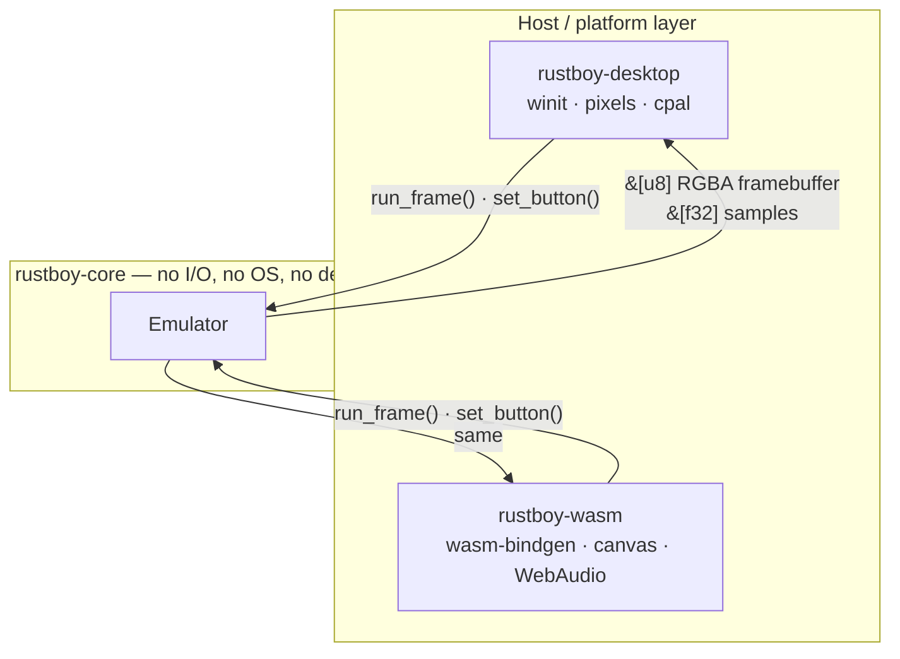

**The rule that makes portability work:** `rustboy-core` never touches files,
wall-clock time, threads, or the screen. It is a pure state machine. The hosts
own the clock, the pixels, and the speakers.

Everything that differs between a browser and a laptop lives in the host crates.
Nothing that differs between them leaks into the core.

---

## 2. The memory map

*Verified against [Pan Docs · Memory Map](https://gbdev.io/pandocs/Memory_Map.html)
on 2026-08-31.*

### 2.1 What a memory map is

The CPU has 16 wires for addresses, so it can name **65,536** slots
(`0000`–`FFFF`). It thinks it's all one big memory. It isn't.

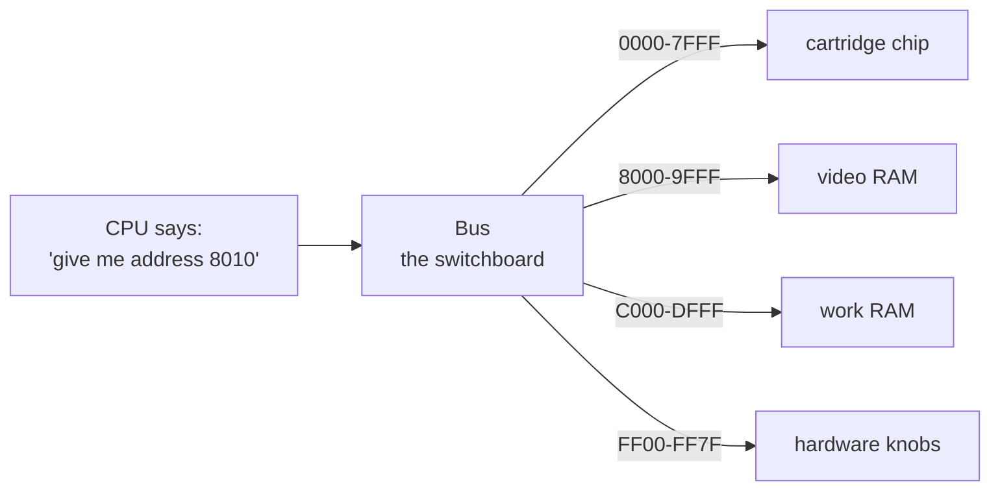

The bus is a **switchboard**. Like a street address: number `8010` goes to the
video building, `C010` goes to the work-RAM building. The CPU never knows the
difference — that's the whole trick.

Three kinds of destination:

| Kind | Example | Behaves like |
|---|---|---|
| Real memory | `C000` WRAM | write a value, read it back |
| Cartridge | `0000` ROM | read-only, it *is* the game |
| **Hardware knobs** | `FF40` LCDC | writing **does** something |

That third kind is the interesting one. Writing to `FF40` doesn't store a
number — bit 7 of it **turns the screen off**. These are *I/O registers*:
addresses wired to hardware switches.


### 2.2 Banking — the one weird trick

A cartridge can hold 8 MB, but the CPU only has room for 32 KB of it. So the
cart carries a chip — an **MBC** (Memory Bank Controller) — that swaps which
slice is visible at `4000–7FFF`.

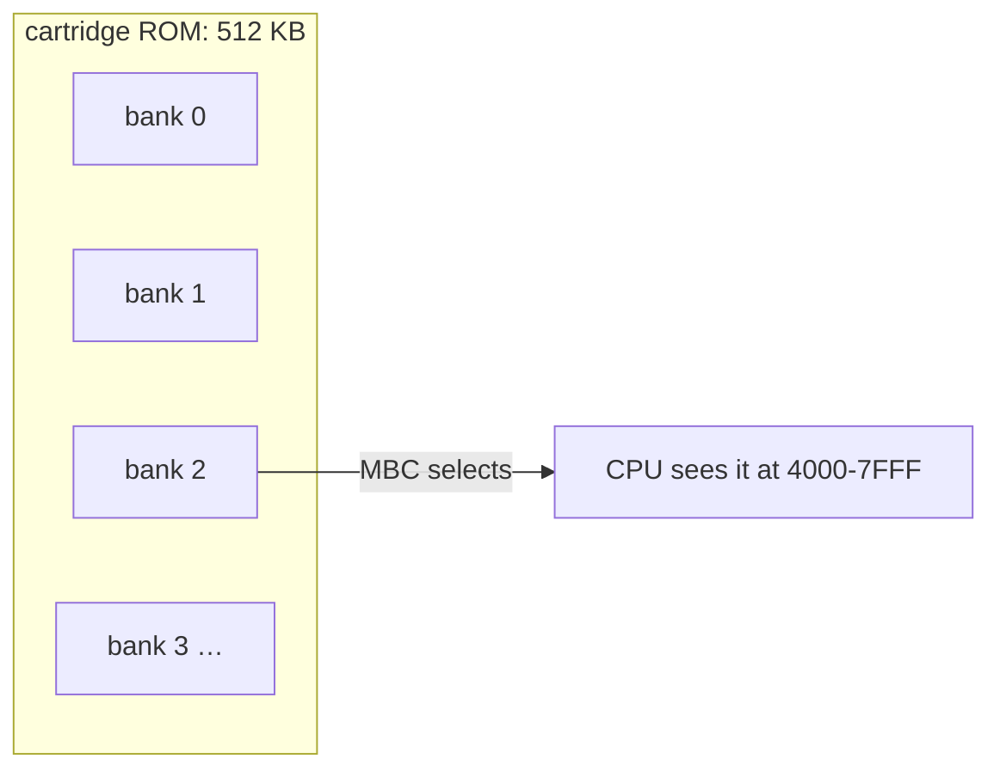

The game writes a bank number to a magic address, and a different 16 KB appears
in the window. Like a slide projector: one carousel, one slot.

The CGB does the same for its own RAM: VRAM has 2 banks (`VBK`), WRAM has 8
(`SVBK`).

### 2.3 The map

| Range | Region | Notes |
|---|---|---|
| `0000–3FFF` | 16 KiB ROM bank 00 | from cartridge, usually fixed |
| `4000–7FFF` | 16 KiB ROM bank 01–NN | switchable via mapper |
| `8000–9FFF` | 8 KiB Video RAM | CGB: switchable bank 0/1 |
| `A000–BFFF` | 8 KiB External RAM | from cartridge, switchable if any |
| `C000–CFFF` | 4 KiB Work RAM | |
| `D000–DFFF` | 4 KiB Work RAM | CGB: switchable bank 1–7 |
| `E000–FDFF` | Echo RAM | mirror of `C000–DDFF`, use prohibited |
| `FE00–FE9F` | Object attribute memory (OAM) | 40 sprites |
| `FEA0–FEFF` | Not usable | use prohibited |
| `FF00–FF7F` | I/O registers | dispatched below |
| `FF80–FFFE` | High RAM (HRAM) | |
| `FFFF` | Interrupt Enable register (IE) | |

### 2.4 I/O ranges

| Range | Purpose | First appeared |
|---|---|---|
| `FF00` | Joypad input | DMG |
| `FF01–FF02` | Serial transfer | DMG |
| `FF04–FF07` | Timer and divider | DMG |
| `FF0F` | Interrupts (`IF`) | DMG |
| `FF10–FF26` | Audio | DMG |
| `FF30–FF3F` | Wave pattern RAM | DMG |
| `FF40–FF4B` | LCD control, status, position, scrolling, palettes | DMG |
| `FF46` | OAM DMA transfer | DMG |
| `FF4C–FF4D` | `KEY0` and `KEY1` — CPU mode / double speed | CGB |
| `FF4F` | VRAM bank select (`VBK`) | CGB |
| `FF50` | Boot ROM mapping control | DMG |
| `FF51–FF55` | VRAM DMA (HDMA) | CGB |
| `FF56` | Infrared port | CGB |
| `FF68–FF6B` | BG / OBJ palettes | CGB |
| `FF6C` | Object priority mode (`OPRI`) | CGB |
| `FF70` | WRAM bank select (`SVBK`) | CGB |

### 2.5 Notable addresses in bank 0

| Address | Meaning |
|---|---|
| `0000, 0008, … 0038` | `RST` jump vectors |
| `0040, 0048, 0050, 0058, 0060` | interrupt vectors — VBlank, STAT, Timer, Serial, Joypad |
| `0100–014F` | cartridge header: title, CGB flag, MBC type, ROM/RAM size, checksums |
| `0100` | entry point — where the CPU starts after boot |

---

## 3. Inside the core

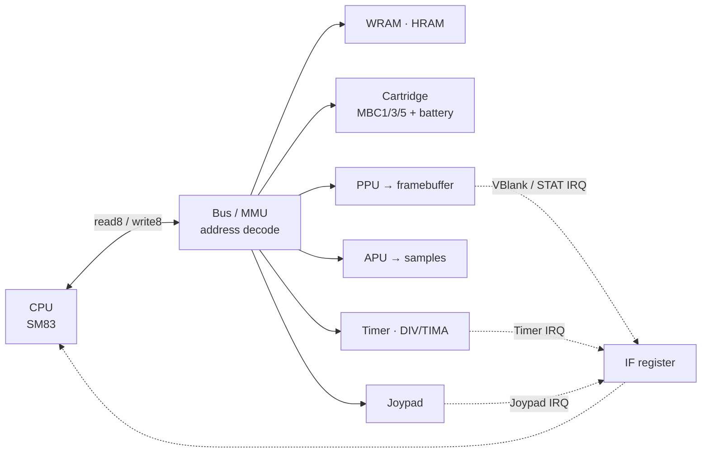

Solid arrows are data (reads/writes). Dashed arrows are interrupt requests —
a peripheral raises a bit in `IF`, and the CPU notices it between instructions.

---

## 4. Decision · Timing model → **tick-accurate**

### 4.1 The idea

Real hardware has no turns: the CPU, the screen and the timer all move on the
same clock edge. In code only one thing runs at a time, so something has to
give. The question is *how coarse the turns are*.

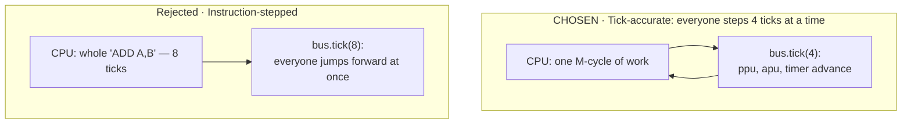

In the rejected model, a 20-tick instruction freezes the screen for all 20 ticks
and then jumps it forward 20. Nothing *inside* those 20 ticks can be observed —
which breaks any game that changes scroll or palette partway through a
scanline, plus a good number of test ROMs.

### 4.2 T-cycles and M-cycles

Two units, and mixing them up is the classic beginner bug:

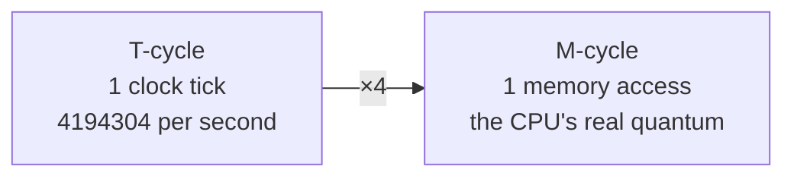

The CPU can only touch memory once per M-cycle. So every instruction is a
**sequence of M-cycles**, and the emulator advances the world 4 T-cycles at a
time, at exactly the moments the real chip would.

### 4.3 What this looks like in code

The tick lives *inside* the memory access, not outside the instruction:

```rust
impl Cpu {
    fn read8(&mut self, bus: &mut Bus, addr: u16) -> u8 {
        bus.tick(4);        // the machine cycle elapses...
        bus.read(addr)      // ...and the value lands at the end of it
    }
}
```

So `INC (HL)` — read, modify, write, 12 T-cycles — becomes three explicit
M-cycles rather than one `return 12`:

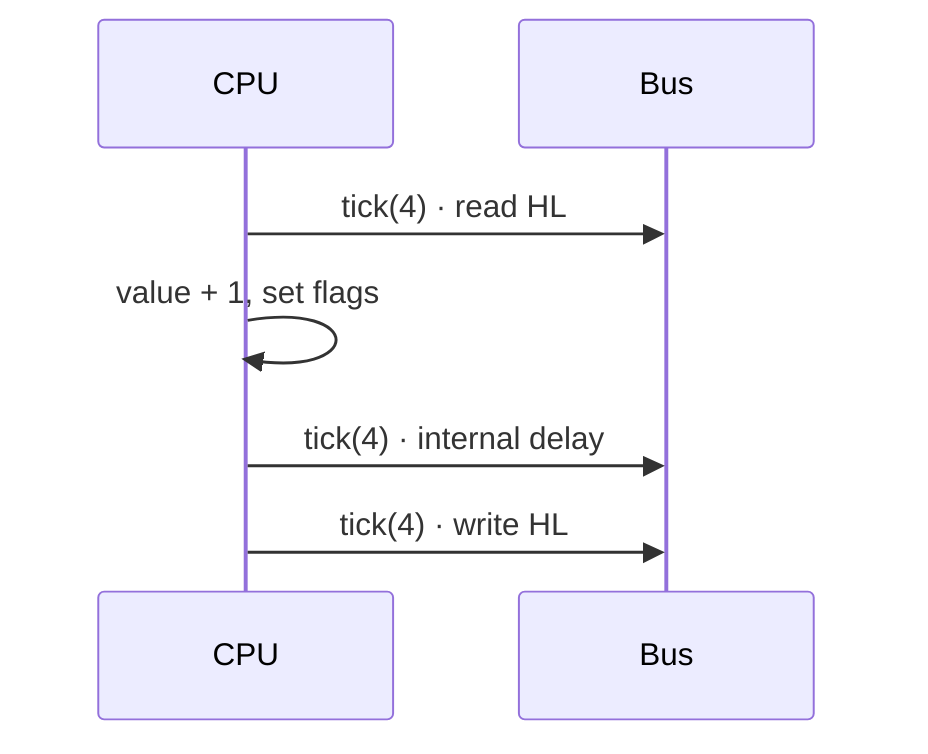

### 4.4 Cost and payoff

| | Tick-accurate | Instruction-stepped |
|---|---|---|
| Effort per opcode | write it as M-cycles | write it once |
| Debugging | see a quarter-result | step, see the result |
| Broken games | ~none | a few |
| Passes Mooneye timing tests | yes | no |
| Retrofit cost | — | rewrite all ~500 opcodes |

**Why chosen:** it's the only decision here that's expensive to undo, and
writing opcodes as M-cycles teaches what the hardware is actually doing on each
clock edge. The extra effort is mostly mechanical once the read/write helpers
exist.

---

## 5. Decision · PPU → **pixel FIFO**

### 5.1 The idea

The real PPU is a **printer head**: it emits one pixel per dot, left to right,
160 per line, 144 lines. It never "draws a line" — it never has more than a few
pixels in hand at once.

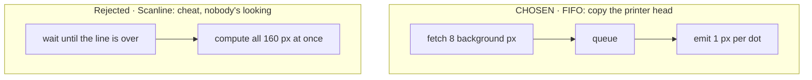

Cheating usually works, because the screen only refreshes 60×/second — nobody
sees the middle of a line. **Unless the game changes scroll or palette
mid-line**, which is the same class of trick that decision 4 exists to support.
Choosing tick-accurate timing and then a scanline renderer would throw away
half the benefit.

### 5.2 The pipeline

Two FIFOs feed one mixer. The fetcher refills the background FIFO 8 pixels at a
time while the mixer drains it one pixel at a time.

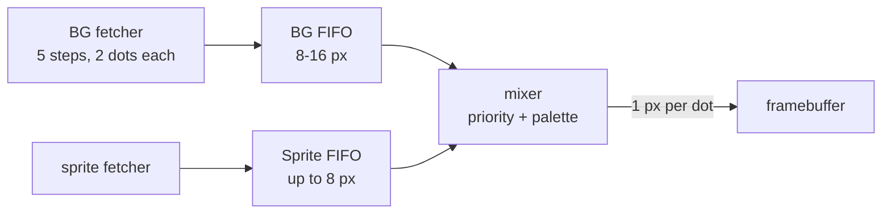

The fetcher's five steps, repeating forever:


### 5.3 Line timing

Each of the 154 lines is 456 dots. Modes 2/3/0 repeat 144 times, then 10 lines
of VBlank.

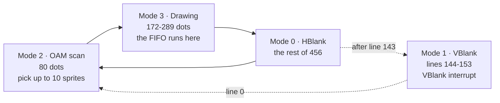

Mode 3's length is **variable** — that's the point. Window starts and sprite
fetches stall the fetcher, pushing HBlank later. A scanline renderer has to fake
this number; a FIFO produces it for free.

### 5.4 Cost and payoff

| | FIFO | Scanline |
|---|---|---|
| Code size | ~600 lines, fiddly | ~200 lines |
| Mode 3 length | emerges naturally | must be faked |
| Mid-line effects | work | break |
| Isolated from the rest? | yes — lives entirely in `ppu/` | yes |

---

## 6. Decision · Bus → **concrete struct, with a test constructor**

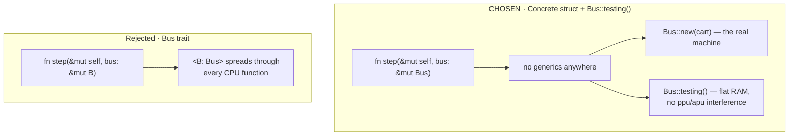

The trait would buy exactly one thing: handing the CPU a dumb 64 KiB array in
tests, so an opcode test can't fail for an unrelated reason. A second
constructor buys the same thing with no type noise:

```rust
impl Bus {
    /// Real machine.
    pub fn new(cart: Cartridge) -> Self { … }

    /// Flat all-RAM cartridge, PPU/APU inert. For opcode unit tests.
    pub fn testing() -> Self { … }
}
```

Same testability, zero generics in the hot path, and the tests exercise the real
address decoder rather than a stand-in.

---

## 7. The frame loop

Tick-accurate timing changes the shape of the loop: the CPU no longer reports
cycles upward. The bus is ticked from *inside* memory accesses, and the PPU
tells us when a frame is finished.

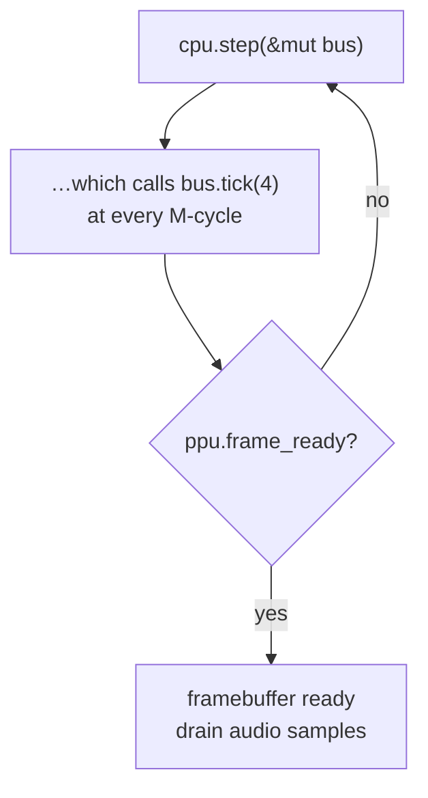

```rust
pub fn run_frame(&mut self) {
    self.bus.ppu.frame_ready = false;
    while !self.bus.ppu.frame_ready {
        self.cpu.step(&mut self.bus);   // ticks the bus internally
    }
}
```

A frame is 70,224 T-cycles ≈ 59.7 Hz, but we wait for the PPU's own VBlank
rather than counting — that stays correct when CGB double-speed mode halves the
CPU's cycle length without changing the PPU's.

The host calls `run_frame()` once per display refresh, then blits
`emu.framebuffer()`. That is the entire host/core contract.

---

## 8. Platform targets

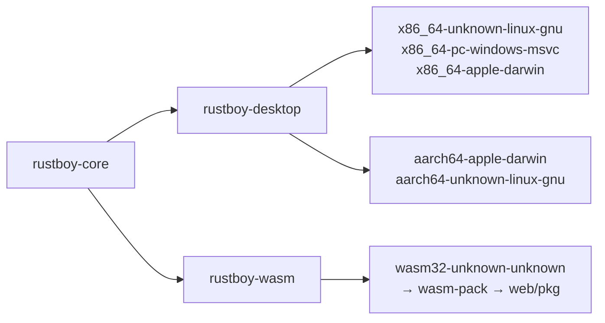

| Concern | Desktop | Web |
|---|---|---|
| Window | `winit` | `<canvas>` |
| Blit | `pixels` (wgpu) | `ImageData` on 2D context |
| Audio | `cpal` | WebAudio |
| Frame clock | `ControlFlow::WaitUntil` | `requestAnimationFrame` |
| ROM input | CLI arg / file dialog | `<input type="file">` |
| Battery saves | file next to ROM | `localStorage` |

Nothing above appears in `rustboy-core`.

---

## 9. Module map

```
rustboy_color/
├── Cargo.toml                    workspace
├── crates/
│   ├── rustboy-core/
│   │   └── src/
│   │       ├── lib.rs            consts: 160×144, 70224, exports
│   │       ├── emulator.rs       run_frame() loop
│   │       ├── bus.rs            address decode · tick(4) · Bus::testing()
│   │       ├── cpu/
│   │       │   ├── registers.rs  AF BC DE HL SP PC + flags
│   │       │   ├── mod.rs        step(), M-cycle read/write helpers, interrupts
│   │       │   └── exec.rs       match opcode { … } as M-cycle sequences
│   │       ├── cartridge/
│   │       │   ├── header.rs     title, CGB flag, MBC type, sizes
│   │       │   └── mbc.rs        MBC1 / MBC3 / MBC5 + battery RAM
│   │       ├── ppu/
│   │       │   ├── mod.rs        mode 2/3/0/1 state machine, LY/STAT
│   │       │   ├── fetcher.rs    5-step BG/window fetcher
│   │       │   ├── fifo.rs       BG + sprite FIFOs, the mixer
│   │       │   └── oam.rs        sprite scan, 10-per-line limit
│   │       ├── apu/              4 channels → f32 samples
│   │       ├── timer.rs          DIV/TIMA falling-edge behaviour
│   │       ├── joypad.rs
│   │       └── serial.rs
│   ├── rustboy-desktop/          winit + pixels + cpal
│   └── rustboy-wasm/             wasm-bindgen → canvas
├── web/                          index.html + main.js
├── scripts/build-web.sh          wasm-pack → web/pkg
└── .github/workflows/ci.yml      x86_64 · aarch64 · wasm32
```

---

## 10. Build order

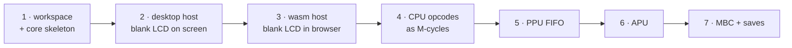

| Stage | Deliverable | Done when |
|---|---|---|
| 1 | workspace + core skeleton, bodies `todo!()` | `cargo check` passes |
| 2 | desktop host | window opens, blank LCD, keys mapped |
| 3 | wasm host | same LCD in a browser tab |
| 4 | SM83 as M-cycle sequences + interrupts | `blargg/cpu_instrs` + `instr_timing` pass |
| 5 | fetcher, FIFOs, mixer, sprite priority | a game's title screen draws |
| 6 | APU, 4 channels | sound |
| 7 | MBC1/3/5 + battery saves | saves survive a reload |

Stages 1–3 are scaffolding. Stages 4–7 are the emulator.

---

## 11. Decision log

| # | Decision | Chosen | Rejected | Reversible? |
|---|---|---|---|---|
| 1 | Frontend split | separate desktop + wasm crates | one shared winit frontend | yes, cheaply |
| 2 | Scaffold depth | skeleton + wiring, `todo!()` bodies | full CPU up front | n/a |
| 3 | Timing | **tick-accurate**, `bus.tick(4)` per M-cycle | instruction-stepped | expensive — chosen deliberately |
| 4 | PPU | **pixel FIFO** | scanline renderer | yes, isolated in `ppu/` |
| 5 | Bus access | **concrete struct + `Bus::testing()`** | `Bus` trait + generics | yes, cheaply |

---

## 12. Prerequisites

| Tool | Status |
|---|---|
| `cargo` / `rustc` 1.98.0 | installed |
| `x86_64-unknown-linux-gnu` target | installed |
| `wasm32-unknown-unknown` target | not installed, needed at stage 3 |
| `wasm-pack` | not installed, needed at stage 3 |
| ALSA headers (`cpal`, Linux) | unverified, needed at stage 2 |

```sh
rustup target add wasm32-unknown-unknown   # stage 3
cargo install wasm-pack                    # stage 3
sudo dnf install alsa-lib-devel            # stage 2, Fedora
```

---

## 13. References

| Resource | Use |
|---|---|
| [Pan Docs](https://gbdev.io/pandocs/) | the hardware reference |
| [Pan Docs · Memory Map](https://gbdev.io/pandocs/Memory_Map.html) | source for §2 |
| [Opcode table](https://gbdev.io/gb-opcodes/optables/) | SM83 decode + cycle counts |
| [Blargg test ROMs](https://github.com/retrio/gb-test-roms) | CPU / timer correctness |
| [Mooneye Test Suite](https://github.com/Gekkio/mooneye-test-suite) | timing edge cases — the reason for §4 |
| [The Cycle-Accurate GB Docs](https://github.com/AntonioND/giibiiadvance/blob/master/docs/TCAGBD.pdf) | PPU FIFO + APU internals |
