# rustboy-color — Architecture

A Game Boy Color emulator in Rust. One emulation core, two homes: a browser tab
(wasm32) and a desktop app (x86_64 and aarch64).

> Written to be **read while building**. Each section explains the real hardware
> in plain words first, then the design that copies it.

---

## 1. Crate layout

Three crates. The middle one is the console; the other two plug it into a
machine.

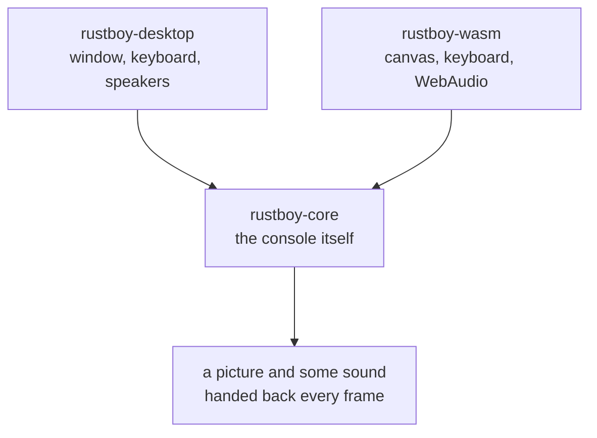

A host asks for one frame. The core runs the machine until the screen finishes a
picture, then hands the picture back. That is the whole agreement between them.

**The rule that makes this work:** `rustboy-core` never opens a file, never asks
the clock what time it is, never starts a thread, never draws anything. It is
pure logic. The hosts own the clock, the pixels and the speakers.

Everything that differs between a browser and a laptop lives in a host crate.
None of it leaks into the core.

---

## 2. The memory map

*Checked against [Pan Docs · Memory Map](https://gbdev.io/pandocs/Memory_Map.html)
on 2026-08-31.*

### 2.1 What a memory map is

The CPU has 16 wires for addresses, so it can name **65,536** places
(`0000`–`FFFF`). It believes they are all one big memory. They are not.

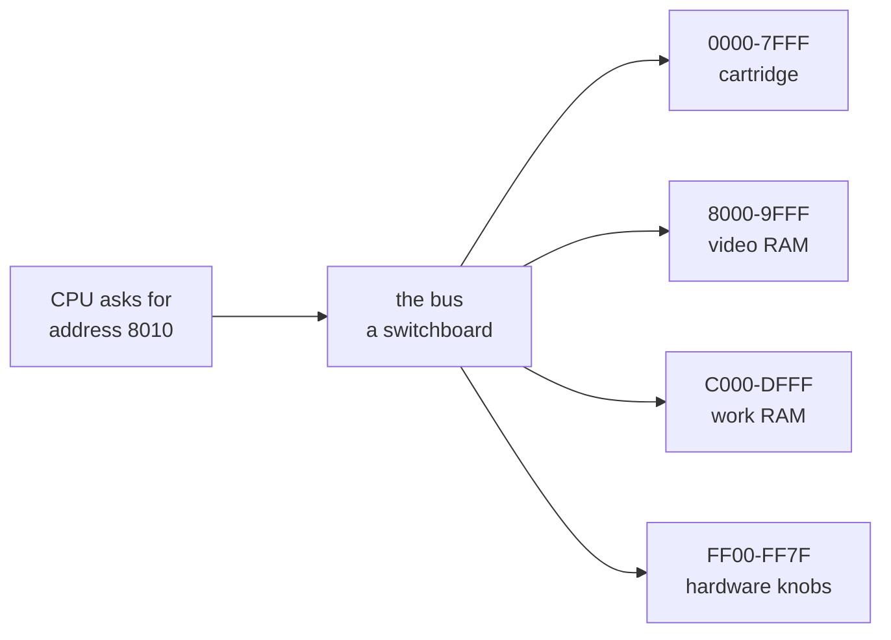

The bus is a **switchboard**. Like house numbers on a street: `8010` is in the
video building, `C010` is in the work-RAM building. The CPU never learns the
difference, and that is the entire trick.

Three kinds of destination:

| Kind | Example | What it does |
|---|---|---|
| Real memory | `C000` work RAM | write a value, read the same value back |
| Cartridge | `0000` ROM | read only — it *is* the game |
| **Hardware knobs** | `FF40` LCDC | writing **does** something |

The third kind is the interesting one. Writing to `FF40` does not store a
number. Bit 7 of it **turns the screen off**. These are *I/O registers*:
addresses wired straight to a switch.

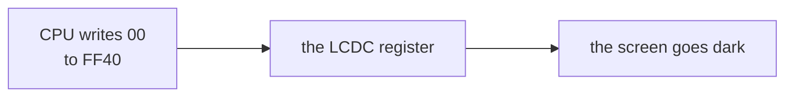

### 2.2 Banking — the one odd trick

A cartridge can hold 8 MB, but the CPU only has room for 32 KB of it at a time.
So the cart carries a chip — an **MBC**, or memory bank controller — that
chooses which slice shows up at `4000–7FFF`.

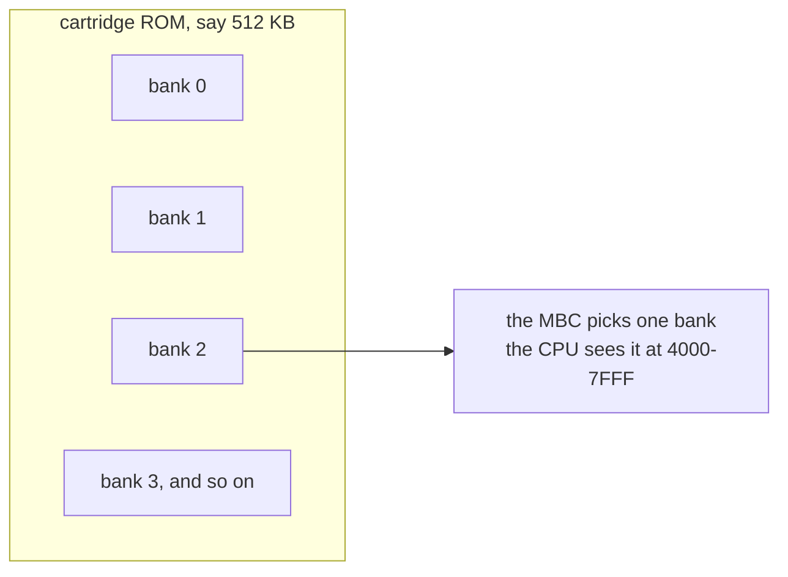

The game writes a bank number to a special address, and a different 16 KB
appears in the window. Like a slide projector: one carousel, one slot.

The Color does the same with its own memory. Video RAM has 2 banks (`VBK`), work
RAM has 8 (`SVBK`).

### 2.3 The map

| Range | Region | Notes |
|---|---|---|
| `0000–3FFF` | 16 KiB ROM bank 00 | from cartridge, usually fixed |
| `4000–7FFF` | 16 KiB ROM bank 01–NN | switchable via mapper |
| `8000–9FFF` | 8 KiB Video RAM | CGB: switchable bank 0/1 |
| `A000–BFFF` | 8 KiB External RAM | from cartridge, switchable if any |
| `C000–CFFF` | 4 KiB Work RAM | |
| `D000–DFFF` | 4 KiB Work RAM | CGB: switchable bank 1–7 |
| `E000–FDFF` | Echo RAM | mirror of `C000–DDFF`, use prohibited |
| `FE00–FE9F` | Object attribute memory (OAM) | 40 sprites |
| `FEA0–FEFF` | Not usable | use prohibited |
| `FF00–FF7F` | I/O registers | dispatched below |
| `FF80–FFFE` | High RAM (HRAM) | |
| `FFFF` | Interrupt Enable register (IE) | |

### 2.4 I/O ranges

| Range | Purpose | First appeared |
|---|---|---|
| `FF00` | Joypad input | DMG |
| `FF01–FF02` | Serial transfer | DMG |
| `FF04–FF07` | Timer and divider | DMG |
| `FF0F` | Interrupts (`IF`) | DMG |
| `FF10–FF26` | Audio | DMG |
| `FF30–FF3F` | Wave pattern RAM | DMG |
| `FF40–FF4B` | LCD control, status, position, scrolling, palettes | DMG |
| `FF46` | OAM DMA transfer | DMG |
| `FF4C–FF4D` | `KEY0` and `KEY1` — CPU mode / double speed | CGB |
| `FF4F` | VRAM bank select (`VBK`) | CGB |
| `FF50` | Boot ROM mapping control | DMG |
| `FF51–FF55` | VRAM DMA (HDMA) | CGB |
| `FF56` | Infrared port | CGB |
| `FF68–FF6B` | BG / OBJ palettes | CGB |
| `FF6C` | Object priority mode (`OPRI`) | CGB |
| `FF70` | WRAM bank select (`SVBK`) | CGB |

### 2.5 Notable addresses in bank 0

| Address | Meaning |
|---|---|
| `0000, 0008, … 0038` | `RST` jump vectors |
| `0040, 0048, 0050, 0058, 0060` | interrupt vectors — VBlank, STAT, Timer, Serial, Joypad |
| `0100–014F` | cartridge header: title, CGB flag, MBC type, ROM/RAM size, checksums |
| `0100` | entry point — where the CPU starts after boot |

---

## 3. Inside the core

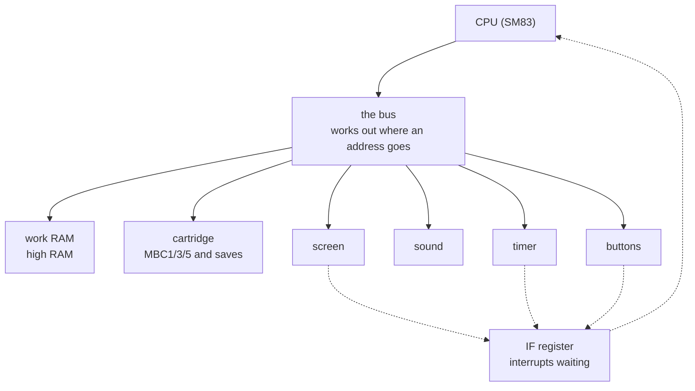

Solid arrows are reads and writes. Dashed arrows are interrupts: a chip raises a
bit in `IF`, and the CPU notices between instructions.

---

## 4. Decision · How time moves → **tick by tick**

### 4.1 The idea

Real hardware takes no turns. The CPU, the screen and the timer all move on the
same clock edge. In code only one thing can run at a time, so something has to
give. The question is only *how big a turn is*.

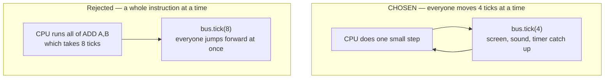

In the rejected version, an instruction lasting 20 ticks freezes the screen for
all 20, then jumps it forward 20. Nothing *inside* those 20 ticks can be seen.
That breaks any game that changes scrolling or colours partway down a line, and
a fair number of test ROMs with it.

### 4.2 Two units of time

Mixing these up is the classic beginner bug:

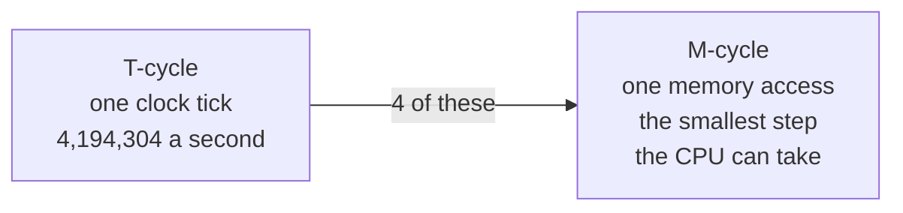

The CPU can only touch memory once per M-cycle. So every instruction is a
**list of M-cycles**, and we move the world forward 4 ticks at a time, at the
exact moments the real chip would.

### 4.3 What that looks like in code

The tick lives *inside* the memory access, not around the instruction:

```rust
impl Cpu {
    fn read8(&mut self, bus: &mut Bus, addr: u16) -> u8 {
        bus.tick(4);        // the machine cycle passes...
        bus.read(addr)      // ...and the value arrives at the end of it
    }
}
```

So `INC (HL)` — read, add one, write — becomes three visible steps instead of
one `return 12`:

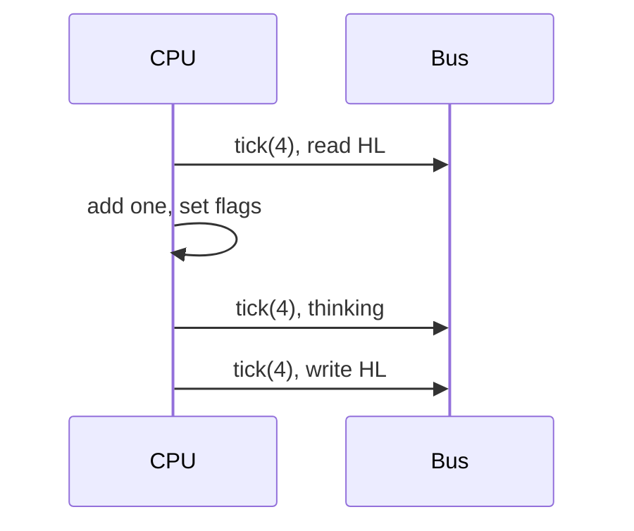

Nobody writes "12" anywhere. It falls out of counting the accesses.

### 4.4 Cost and payoff

| | Tick by tick | Instruction at a time |
|---|---|---|
| Work per opcode | write it as small steps | write it once |
| Debugging | you can see a half-finished result | step, see the result |
| Broken games | about none | a few |
| Passes the Mooneye timing tests | yes | no |
| Cost of changing later | — | rewrite all ~500 opcodes |

**Why chosen:** it is the only decision here that is expensive to undo, and
writing opcodes as small steps teaches what the hardware is really doing on each
clock edge. Once the read and write helpers exist, the extra work is mostly
mechanical.

---

## 5. Decision · The screen → **pixel FIFO**

### 5.1 The idea

The real screen chip works like a **printer head**. It puts out one pixel per
tick, left to right, 160 per line, 144 lines. It never "draws a line" — it never
holds more than a few pixels at once.

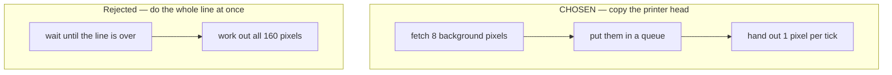

Cheating usually works, because the screen only refreshes 60 times a second and
nobody sees the middle of a line. **Unless the game changes scrolling or colours
halfway across**, which is exactly the kind of trick decision 4 exists to
support. Choosing tick-by-tick timing and then cheating here would throw away
half the benefit.

### 5.2 The pipeline

Two queues feed one mixer. The fetcher refills the background queue 8 pixels at
a time while the mixer empties it one pixel at a time.

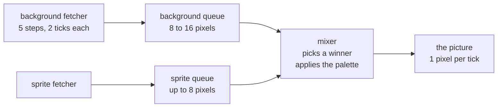

The fetcher's five steps, round and round:

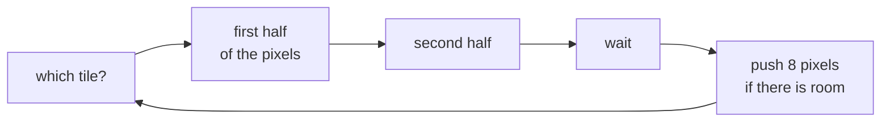

### 5.3 Line timing

Each of the 154 lines lasts 456 ticks. Modes 2, 3 and 0 repeat 144 times, then
10 lines of VBlank.

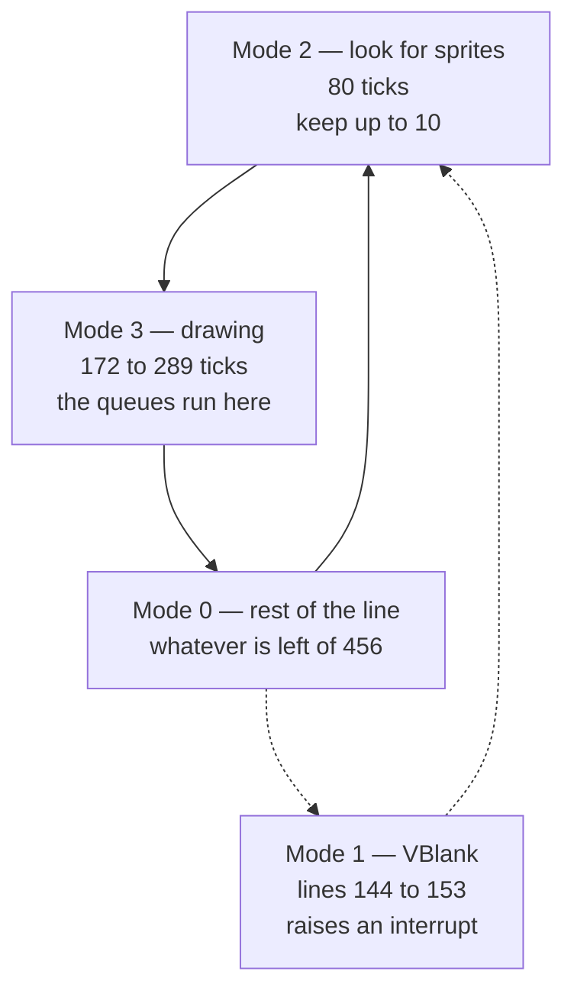

Mode 3's length **changes**, and that is the point. The window starting and
sprites being fetched both stall the fetcher, pushing the rest of the line
later. Doing a whole line at once means faking this number; the queues produce
it for free.

### 5.4 Cost and payoff

| | Pixel queues | Whole line at once |
|---|---|---|
| Code size | about 600 fiddly lines | about 200 |
| Length of mode 3 | comes out on its own | must be faked |
| Mid-line tricks | work | break |
| Contained? | yes, all inside `ppu/` | yes |

---

## 6. Decision · The bus → **a plain struct, plus a test version**

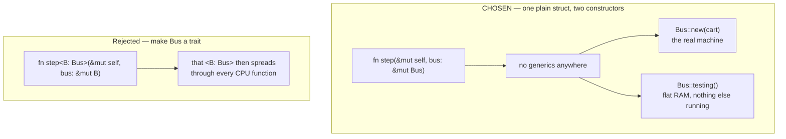

The trait would buy exactly one thing: handing the CPU a dumb 64 KiB array in
tests, so an opcode test cannot fail for an unrelated reason. A second
constructor buys the same thing with no extra type noise:

```rust
impl Bus {
    /// The real machine.
    pub fn new(cart: Cartridge) -> Self { … }

    /// Everything writable, screen and sound idle. For opcode tests.
    pub fn testing() -> Self { … }
}
```

Same testability, no generics in the code that runs most, and the tests exercise
the real address decoding instead of a stand-in.

---

## 7. The frame loop

Because time moves tick by tick, the CPU never reports cycles back up. The bus
is ticked from *inside* memory accesses, and the screen says when a picture is
done.

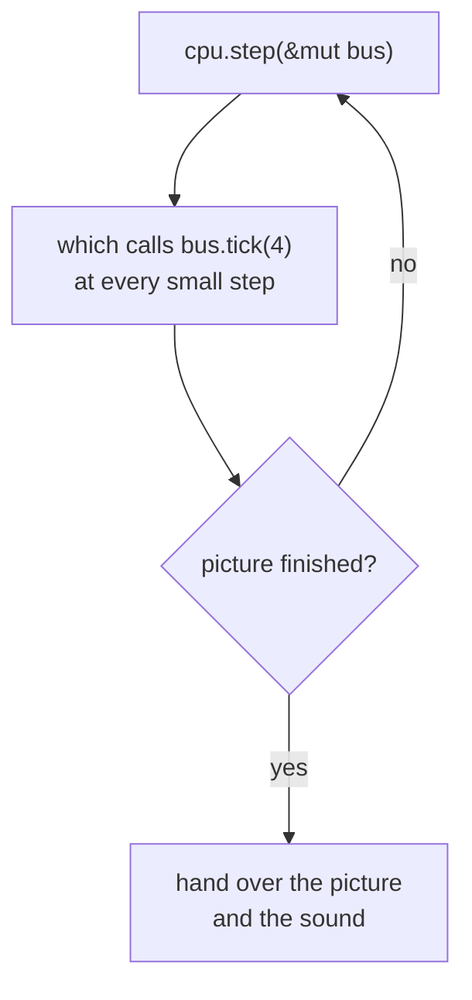

```rust
pub fn run_frame(&mut self) {
    self.bus.ppu.frame_ready = false;
    while !self.bus.ppu.frame_ready {
        self.cpu.step(&mut self.bus);   // ticks the bus from inside
    }
}
```

A frame is 70,224 ticks, about 59.7 a second. We wait for the screen to say so
rather than counting, because that stays right when the Color runs its CPU at
double speed and leaves the screen alone.

The host calls `run_frame()` once per refresh, then copies `emu.framebuffer()`
to the display. That is the whole contract.

---

## 8. Platform targets

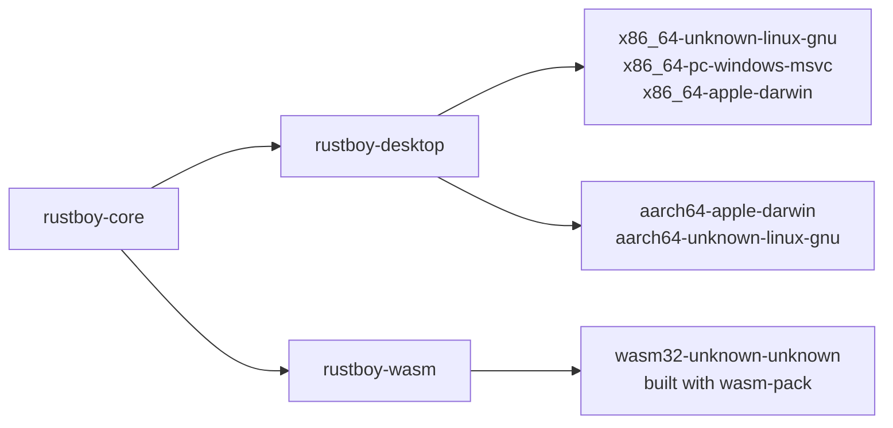

| Job | Desktop | Web |
|---|---|---|
| Window | `winit` | `<canvas>` |
| Showing the picture | `pixels` (wgpu) | `ImageData` on a 2D context |
| Sound | `cpal` | WebAudio |
| Frame timing | `ControlFlow::WaitUntil` | `requestAnimationFrame` |
| Loading a ROM | command line or file dialog | `<input type="file">` |
| Saves | a file next to the ROM | `localStorage` |

None of the above appears in `rustboy-core`.

---

## 9. Module map

```
rustboy_color/
├── Cargo.toml                    workspace
├── crates/
│   ├── rustboy-core/
│   │   └── src/
│   │       ├── lib.rs            sizes and speeds, plus the exports
│   │       ├── emulator.rs       run_frame()
│   │       ├── bus.rs            address decoding, tick(4), Bus::testing()
│   │       ├── cpu/
│   │       │   ├── registers.rs  a, f, b to l, sp, pc, and the flags
│   │       │   ├── mod.rs        step(), memory helpers, interrupts
│   │       │   └── exec.rs       match opcode { … }, as small steps
│   │       ├── cartridge/
│   │       │   ├── header.rs     title, Color flag, MBC type, sizes
│   │       │   └── mbc.rs        MBC1 / MBC3 / MBC5 and save RAM
│   │       ├── ppu/
│   │       │   ├── mod.rs        the 4 modes, LY and STAT
│   │       │   ├── fetcher.rs    the 5-step background fetcher
│   │       │   ├── fifo.rs       the two queues and the mixer
│   │       │   └── oam.rs        sprite search, 10 per line
│   │       ├── apu/              4 channels turned into samples
│   │       ├── timer.rs          DIV and TIMA
│   │       ├── joypad.rs
│   │       └── serial.rs
│   ├── rustboy-splash/
│   │   ├── assets/source.jpeg    the photo the title screen is made from
│   │   ├── build.rs              turns it into pixels at compile time
│   │   └── src/lib.rs            the fade, as two layers
│   ├── rustboy-frontend/
│   │   └── src/lib.rs            the Host trait and the frame driver
│   ├── rustboy-desktop/          winit + pixels
│   └── rustboy-wasm/             wasm-bindgen and a canvas
├── web/                          index.html + main.js
├── scripts/build-web.sh          wasm-pack into web/pkg
└── .github/workflows/ci.yml      x86_64, aarch64, wasm32
```

---

## 10. Build order

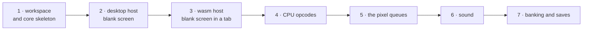

| Stage | What it delivers | Done when |
|---|---|---|
| 1 | workspace and core skeleton, bodies `todo!()` | `cargo check` passes |
| 2 | desktop host | a window opens, blank screen, keys mapped |
| 3 | wasm host | the same blank screen in a browser tab |
| 4 | the SM83 as small steps, plus interrupts | `blargg/cpu_instrs` and `instr_timing` pass |
| 5 | fetcher, queues, mixer, sprite priority | a game's title screen appears |
| 6 | sound, all 4 channels | you can hear it |
| 7 | MBC1/3/5 and battery saves | a save survives a reload |

Stages 1 to 3 are scaffolding. Stages 4 to 7 are the emulator.

---

## 11. Decision log

| # | Decision | Chosen | Rejected | Easy to change later? |
|---|---|---|---|---|
| 1 | Frontend split | separate desktop and wasm crates | one shared winit frontend | yes, cheaply |
| 2 | Scaffold depth | skeleton and wiring, `todo!()` bodies | full CPU up front | n/a |
| 3 | Timing | **tick by tick**, `bus.tick(4)` per small step | one instruction at a time | no — chosen on purpose |
| 4 | Screen | **pixel queues** | whole line at once | yes, it is all inside `ppu/` |
| 5 | Bus access | **plain struct + `Bus::testing()`** | a `Bus` trait with generics | yes, cheaply |

---

## 12. Prerequisites

| Tool | Status |
|---|---|
| `cargo` / `rustc` 1.98.0 | installed |
| `x86_64-unknown-linux-gnu` target | installed |
| `wasm32-unknown-unknown` target | not installed, needed at stage 3 |
| `wasm-pack` | not installed, needed at stage 3 |
| ALSA headers (`cpal`, Linux) | unverified, needed at stage 2 |

```sh
rustup target add wasm32-unknown-unknown   # stage 3
cargo install wasm-pack                    # stage 3
sudo dnf install alsa-lib-devel            # stage 2, Fedora
```

---

## 13. References

| Resource | Use |
|---|---|
| [Pan Docs](https://gbdev.io/pandocs/) | the hardware reference |
| [Pan Docs · Memory Map](https://gbdev.io/pandocs/Memory_Map.html) | source for §2 |
| [Opcode table](https://gbdev.io/gb-opcodes/optables/) | SM83 instructions and cycle counts |
| [Blargg test ROMs](https://github.com/retrio/gb-test-roms) | CPU and timer correctness |
| [Mooneye Test Suite](https://github.com/Gekkio/mooneye-test-suite) | timing edge cases — the reason for §4 |
| [The Cycle-Accurate GB Docs](https://github.com/AntonioND/giibiiadvance/blob/master/docs/TCAGBD.pdf) | screen and sound internals |
