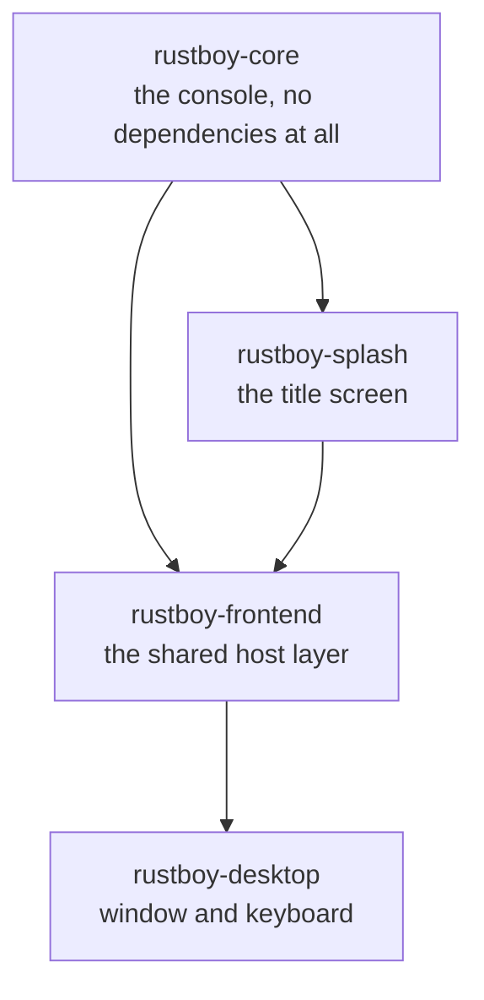
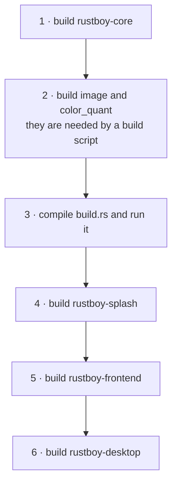
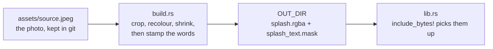
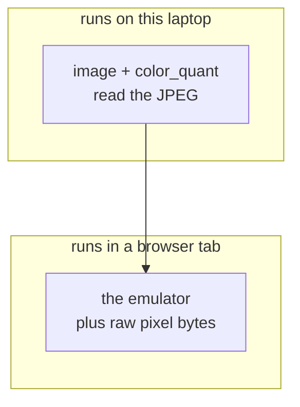

# How the build works

Cargo works the whole thing out on its own. There is no Makefile and no order
written down anywhere: it all comes from who depends on whom.

---

## The crates



An arrow means "is needed by". The browser host will hang off `rustboy-frontend`
in the same place the desktop one does.

---

## The order

Cargo reads the workspace file, finds the four crates, and sorts them.



Crates that do not need each other are built at the same time, so the real
output is less tidy than this list.

---

## The odd step: a build script

`rustboy-splash` has a `build.rs`. Cargo compiles it into a small program and
runs it *before* the crate itself, handing it a scratch folder called `OUT_DIR`.



This is why the generated files are not in the repository. Only the photo is
kept; the two layers are rebuilt whenever they are missing.

`OUT_DIR` is a scratch folder inside `target`:

```
target/debug/build/rustboy-splash-<hash>/out/splash.rgba
target/debug/build/rustboy-splash-<hash>/out/splash_text.mask
```

The hash changes with the profile, the features and the target, so there can be
more than one of these at a time and the path must never be written down. That
is what `env!("OUT_DIR")` is for.

### When it runs again

Two lines decide that:

```rust
println!("cargo::rerun-if-changed=build.rs");
println!("cargo::rerun-if-changed={}", source.display());
```

Change the photo or the script, and the title screen is rebuilt. Change anything
else and Cargo skips straight past, reusing what is already in `OUT_DIR`.

---

## Two kinds of dependency

This is the part worth remembering.

| | compiled for | example |
| --- | --- | --- |
| `[dependencies]` | the machine being **targeted** | `winit`, `pixels` |
| `[build-dependencies]` | the machine **doing the building** | `image`, `color_quant` |



So when the browser build arrives, the JPEG is still decoded here, natively, at
build time. The browser only ever receives plain pixel bytes, and no image
library is shipped to it.

---

## Commands

```sh
cargo build --workspace      # everything
cargo run -p rustboy-desktop # the window
cargo test --workspace       # every test
```

To force the title screen to be rebuilt without changing the photo:

```sh
touch crates/rustboy-splash/build.rs
```
