# The core, module by module

What each module in `rustboy-core` is for, how it works, and how the pieces fit
together. Plain descriptions, one module at a time, ending with the part that
glues them all into a console.

- [The shape of it](#the-shape-of-it)
- [cpu](#cpu)
- [bus](#bus)
- [cartridge](#cartridge)
- [ppu](#ppu)
- [apu](#apu)
- [timer](#timer)
- [joypad](#joypad)
- [serial](#serial)
- [emulator](#emulator)
- [Reading order](#reading-order)

---

## The shape of it

One rule explains the whole layout: **only the CPU talks to the bus, and only
the bus talks to everything else.**

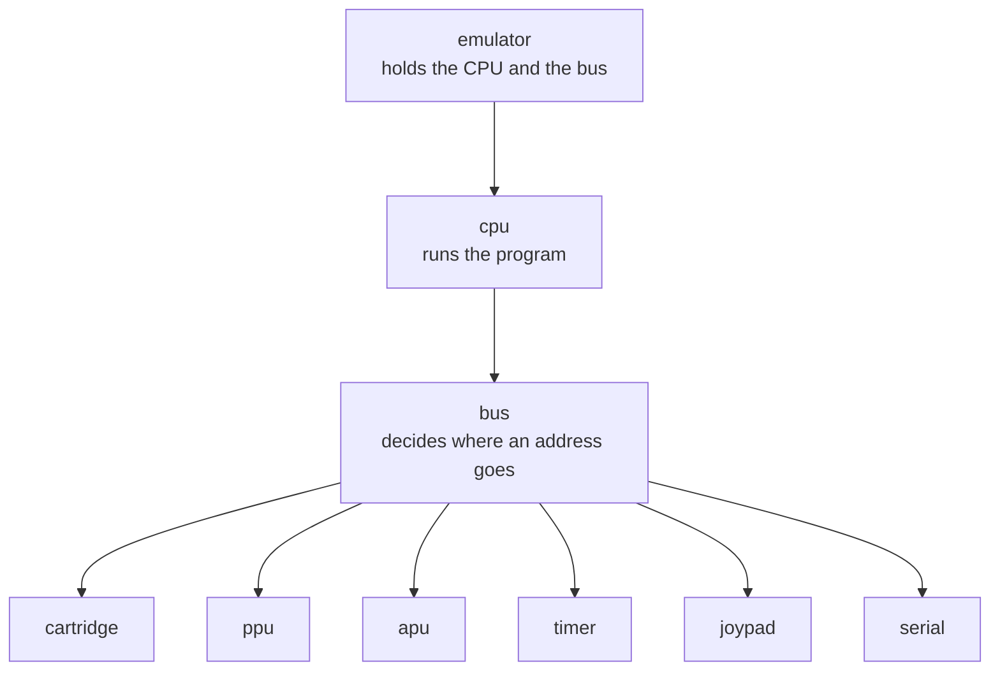

No module reaches sideways. The screen never calls the timer. That is what keeps
each one small enough to hold in the head.

`lib.rs` sits above all of it and holds nothing but the fixed numbers of the
machine: a 160 by 144 screen, 4,194,304 ticks a second, 70,224 ticks a frame,
and 48,000 sound samples a second.

---

## cpu

**The part that runs the program.** Three files: the registers, the main loop,
and the list of instructions.

The loop is short. Check for interrupts, read a byte, do what it says, repeat.

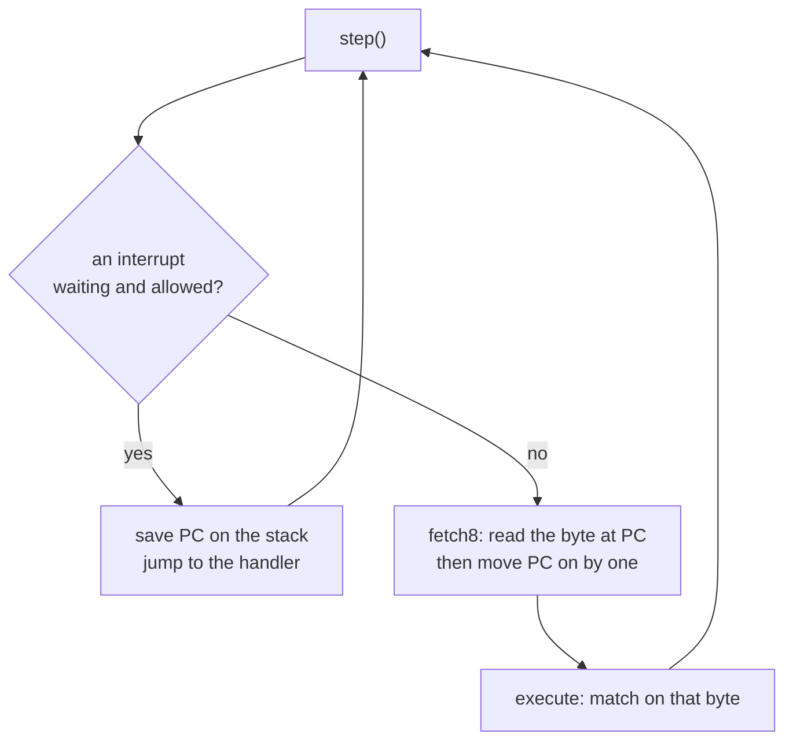

`registers.rs` holds the values the CPU works on directly: `a` for sums, `b`
through `l` as spare bytes, `sp` pointing at the stack, `pc` pointing at the
next instruction. The four flags are stored as four separate booleans rather
than bits, because that is easier to read and easier to get right. They are
packed back into a byte only when something asks for `F`.

`mod.rs` holds the loop above, and the helpers every instruction is built from:
`read8`, `write8`, `fetch8`, `fetch16`, `push16`, `pop16`, and `idle`. All of
them tick the bus by one machine cycle before the value moves. That single
detail is why timing never has to be written down anywhere.

`exec.rs` is one `match` over the opcode byte. Each arm performs the same steps
the real chip performs. Anything not yet written reaches `todo!()`, which panics
naming the opcode and the address it came from.

The full instruction list lives in [`cpu-operation.md`](cpu-operation.md).

---

## bus

**The switchboard.** The CPU asks for an address; the bus works out which chip
owns it and passes the request along.

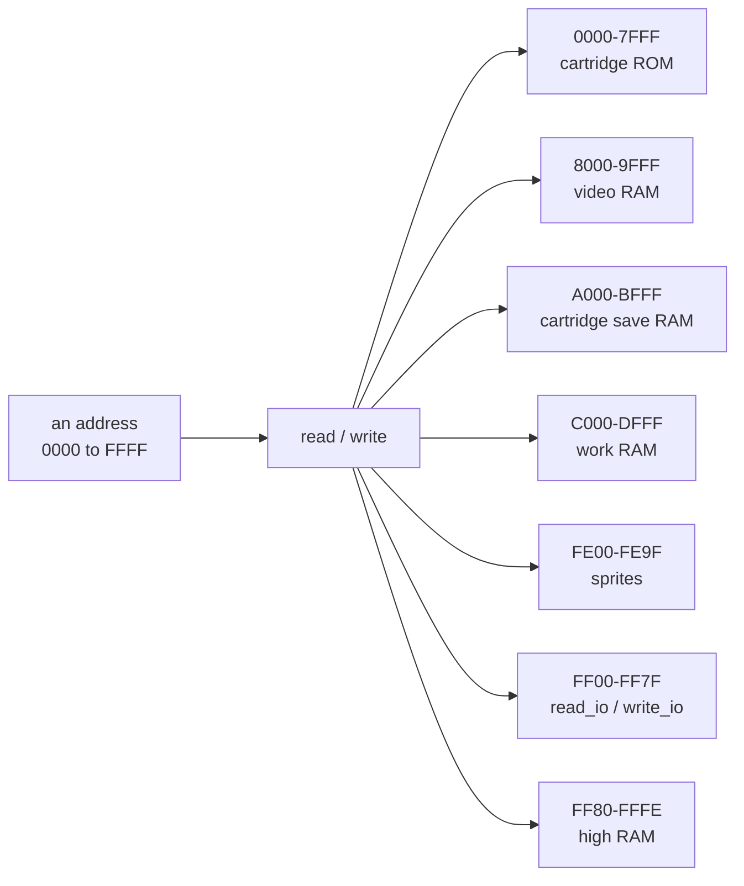

`read` and `write` sort the whole 64 KB into big regions. One of those regions,
`FF00`–`FF7F`, is 128 single-byte controls belonging to six different chips, so
it gets its own pair of functions, `read_io` and `write_io`, that sort it by
individual address.

The bus also owns `tick`, which is how time passes:

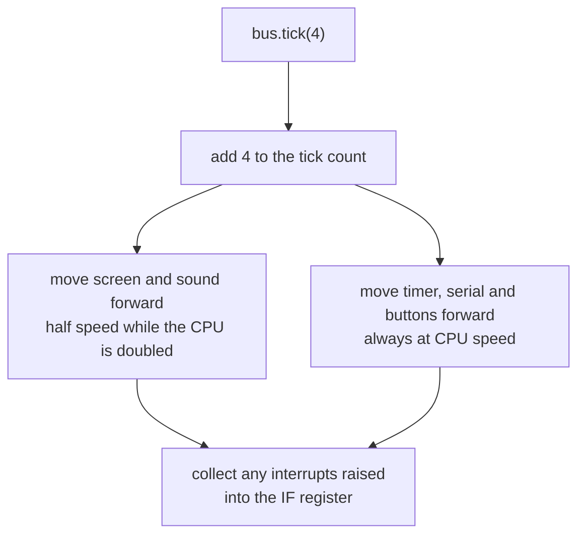

A few registers live directly on the bus because they belong to no single chip:
`IF` and `IE` for interrupts, `SVBK` for work RAM banking, `KEY1` for speed.

`Bus::testing()` builds a machine whose whole address space is writable, so
instruction tests can place code anywhere without a real game.

---

## cartridge

**The game.** A ROM image, some save RAM, and the chip that swaps banks between
them.

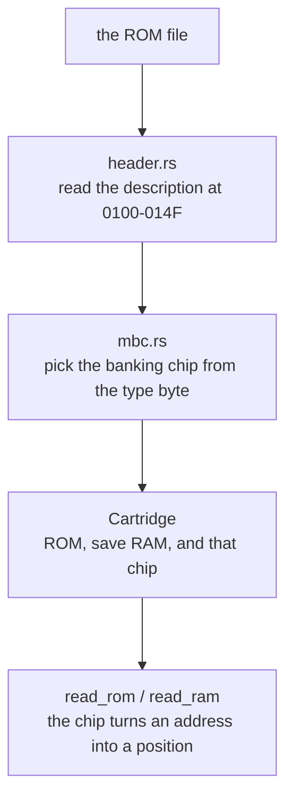

`header.rs` reads the block every cartridge uses to describe itself: title,
whether it wants Color features, which banking chip it carries, and how much ROM
and RAM it has. One quirk handled here — the Color flag sits on the title's last
byte, so Color titles are one character shorter.

`mbc.rs` models the banking chip. Writing into ROM space is not a memory write
at all; it is how a game gives that chip orders. Only the no-chip case is
written so far, and MBC1, MBC3 and MBC5 are marked for later.

`mod.rs` ties the two together and adds save-RAM loading. Its `Debug` is written
by hand on purpose: deriving it would dump an entire ROM into a panic message.

---

## ppu

**The screen.** The biggest module, and the one that will grow the most.

A real screen chip works like a printer head: one pixel per tick, left to right,
never holding more than a few at once. Each line is 456 ticks and passes through
the same stages.

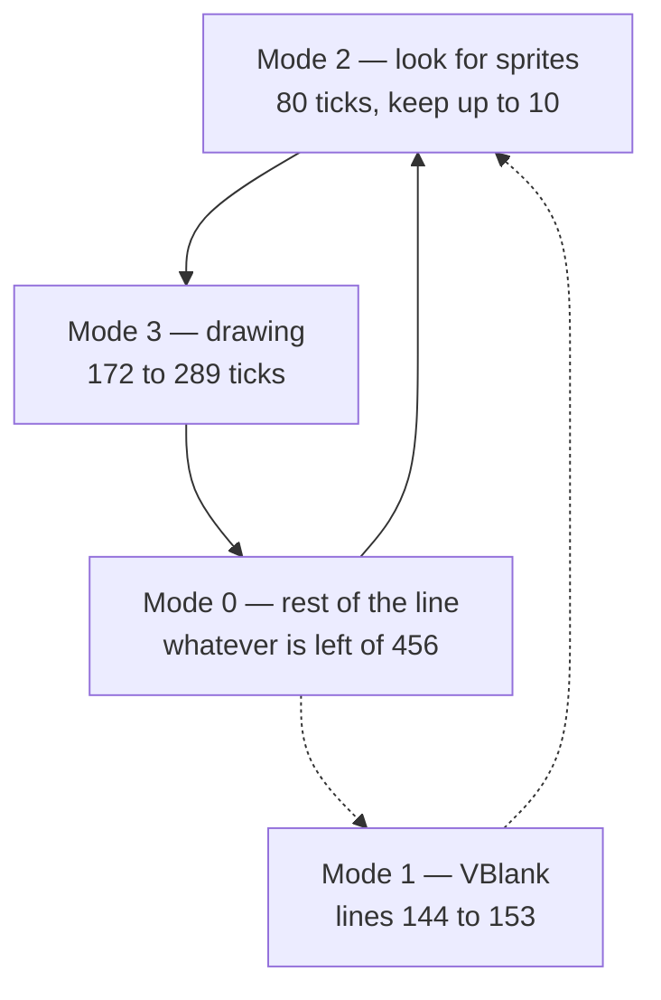

`mod.rs` runs those stages one tick at a time, keeps every screen register, and
raises the VBlank and STAT interrupts. It also owns video RAM and the sprite
table. Today it paints each line a flat off-white; the real pixels come later.

The other three files are the pipeline that will replace that flat fill:

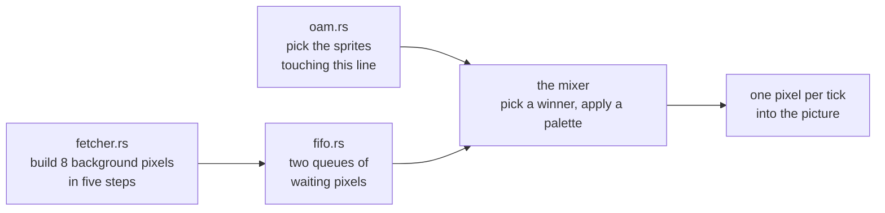

`fetcher.rs` walks five steps, two ticks each: which tile, first half of the
pixels, second half, wait, then push eight into the queue. `fifo.rs` holds those
queues. `oam.rs` searches the forty sprites and keeps the first ten that touch
the current line, which is the real hardware limit.

Splitting mode 3 across these three files is what makes its length come out on
its own instead of being faked.

---

## apu

**The sound chip.** Registers are remembered, and silence is produced at exactly
the right rate.

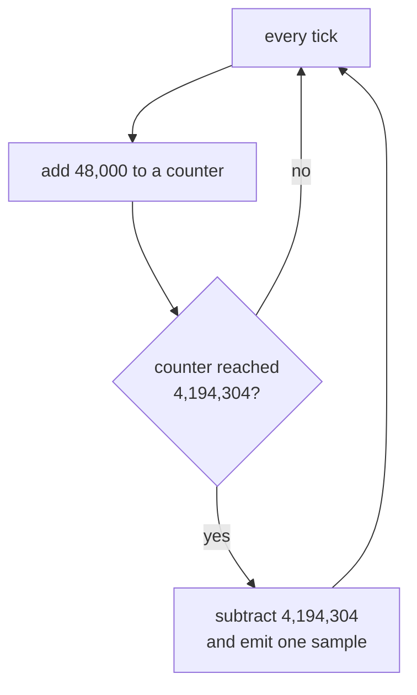

That counter is the whole trick. Whole numbers only, so the sample rate never
drifts the way repeated floating-point division would. The queue is capped at
about a second of audio, so a host that stops collecting cannot make it grow
without limit.

Four channels of real sound arrive in a later stage.

---

## timer

**The counters a game uses to measure time.** Four registers, one subtlety.

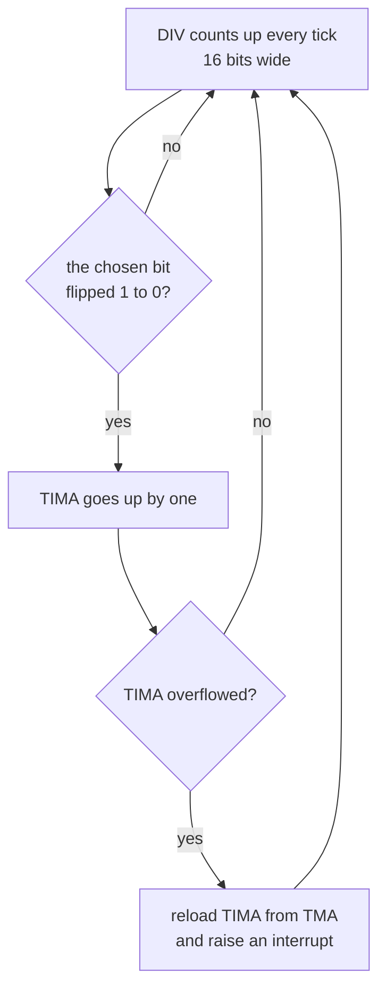

The subtlety is that middle step. `TIMA` does not tick on a division of the
clock; it ticks when one particular bit of `DIV` falls from 1 to 0. `TAC`
chooses which bit — 9, 3, 5 or 7 — which is what sets the speed.

The consequence catches everyone out: writing to `DIV` resets it to zero, and if
the chosen bit was 1, that counts as a fall, so `TIMA` ticks. Modelling it the
hardware way gets that for free.

---

## joypad

**The buttons**, read through one register at `FF00`.

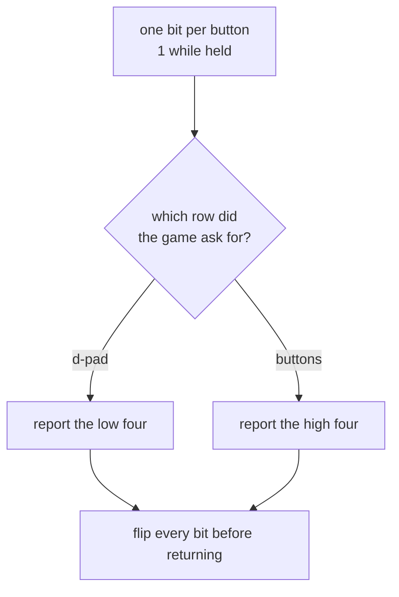

Two things to remember. The hardware is inverted, so a held button reads as 0 —
which is why the code starts from all ones and clears bits. And the eight
buttons share four wires, so the game selects a row first and reads it second.

Pressing a button also raises an interrupt, which the bus collects on its next
tick.

---

## serial

**The link cable port.** Nothing is plugged in, so nothing real happens.

It exists for one reason: test ROMs print through it. Writing `0x81` to the
control register means "send this byte", so the byte gets appended to a list
that a test can read back later.

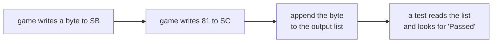

Without it there is no way to tell whether the CPU is correct.

---

## emulator

**The glue.** It owns a CPU and a bus, and offers a host the handful of things a
host actually needs: load a game, run a frame, take the picture, take the sound,
press a button, save and restore.

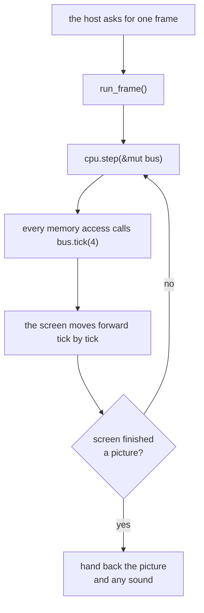

`run_frame` waits for the screen to say a picture is done rather than counting
ticks, because the Color can run its CPU at double speed while the screen keeps
its own pace. A ceiling stops the loop if the screen is switched off and never
finishes.

With no cartridge loaded it still ticks the bus, so a host gets a blank screen
rather than a frozen window.

Everything below is one call away from a host, and nothing above it exists:

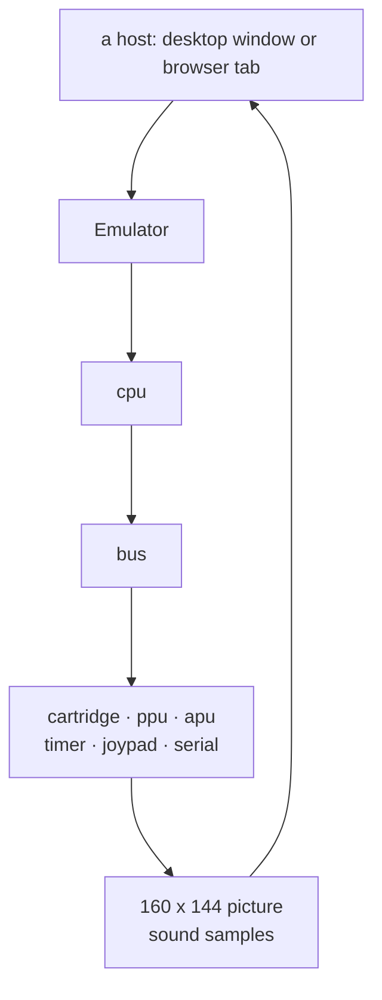

---

## Reading order

Four files explain the design; the rest follow from them.

| Order | File | Why it comes first |
| ----- | ---- | ------------------ |
| 1 | `lib.rs` | the fixed numbers everything else is measured in |
| 2 | `cpu/mod.rs` | the loop, and the tick-inside-every-access idea |
| 3 | `bus.rs` | where every address goes, and how time reaches the chips |
| 4 | `emulator.rs` | how a frame is produced from the two above |

After those, any single module can be read on its own.
