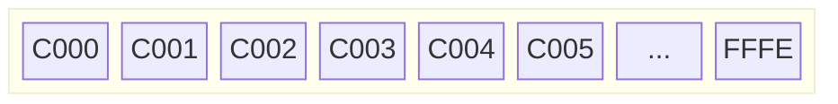
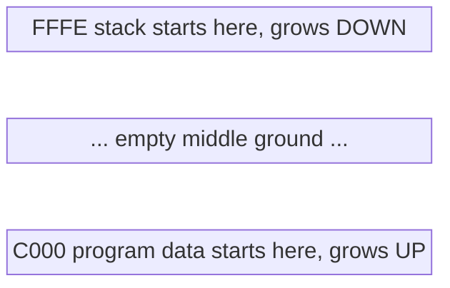
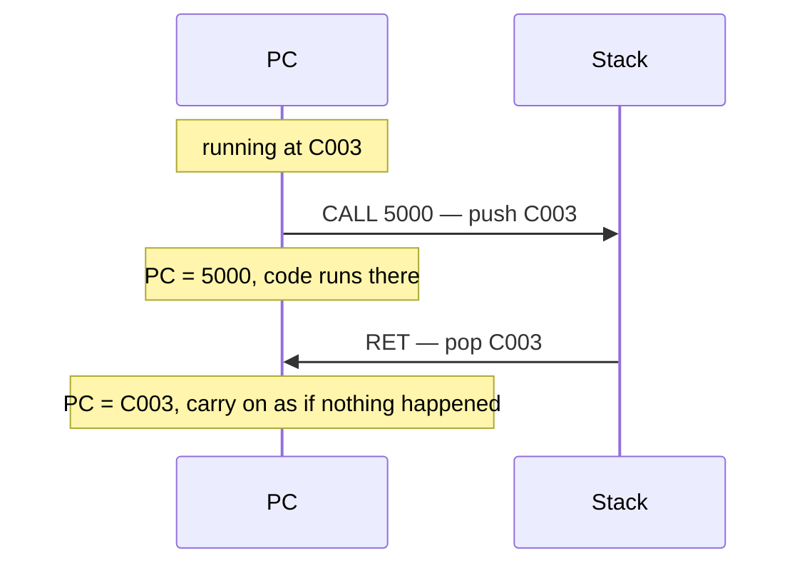
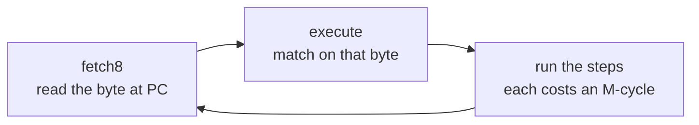

# How the CPU runs

How the SM83 walks through a program: the two address registers that drive it,
and the full list of instructions it understands.

- [1. Memory is a long street of numbered houses](#1-memory-is-a-long-street-of-numbered-houses)
- [2. PC is a finger pointing at the street](#2-pc-is-a-finger-pointing-at-the-street)
- [3. SP is a spike that notes get pushed onto](#3-sp-is-a-spike-that-notes-get-pushed-onto)
- [4. The two of them together](#4-the-two-of-them-together)
- [5. One line each](#5-one-line-each)
- [6. What one instruction actually does](#6-what-one-instruction-actually-does)
- [7. The opcode tables](#7-the-opcode-tables)

---

## 1. Memory is a long street of numbered houses



Every house holds one byte. The address is the house number. That is the whole
model.

---

## 2. PC is a finger pointing at the street

PC = **program counter**. It says *which house the CPU reads next*.

The CPU only ever does this:


That is running a program. Nothing more.

### Watch it walk

Say memory holds this, and PC starts at `C000`:

| address | byte | meaning        |
| ------- | ---- | -------------- |
| `C000`  | `00` | NOP — do nothing |
| `C001`  | `00` | NOP — do nothing |
| `C002`  | `00` | NOP — do nothing |

Step by step:

```
start     PC = C000
          read C000 -> 00 (NOP)   PC becomes C001
          read C001 -> 00 (NOP)   PC becomes C002
          read C002 -> 00 (NOP)   PC becomes C003
```

The finger slides right, one house at a time.

### A jump just moves the finger

`JP 1234` means "carry on from `1234` instead". Three bytes:

| address | byte | meaning              |
| ------- | ---- | -------------------- |
| `C000`  | `C3` | JP — jump            |
| `C001`  | `34` | low half of address  |
| `C002`  | `12` | high half of address |

```
PC = C000   read C3   -> "it's a jump"     PC becomes C001
PC = C001   read 34   -> low half          PC becomes C002
PC = C002   read 12   -> high half         PC becomes C003
            glue them: 1234
            PC = 1234                      <- finger teleports
```

In the code (`cpu/exec.rs`):

```rust
0xC3 => {
    let addr = self.fetch16(bus);   // reads the two halves, PC moves past them
    self.idle(bus);
    self.regs.pc = addr;            // finger jumps
}
```

Note the address is stored **backwards**: `34` then `12` makes `1234`. The Game
Boy always stores the low half first.

---

## 3. SP is a spike that notes get pushed onto

SP = **stack pointer**. It points at a pile of scrap paper.

It exists to solve one problem: **if the finger teleports, how does it get
back?**


The answer: before jumping, write down where it was. That note goes on the
pile.

### The pile grows downward

SP starts at `FFFE`, the top of memory, and moves **down** as notes pile up.

```
        empty                after 1 push           after 2 pushes

FFFE  --------  <- SP      --------               --------
FFFD  --------             --------               --------
FFFC                       [ note ]  <- SP        [ note ]
FFFB                                              [ note ]  <- SP
FFFA
```

Why downward? A program and its data grow **up** from the bottom. The stack
grows **down** from the top. They start as far apart as possible.



### push and pop

| | what happens |
| --- | --- |
| **push** | SP moves down, then the value is written there |
| **pop** | the value is read, then SP moves back up |

Two bytes each time, because PC is 16 bits wide:

```rust
pub(crate) fn push16(&mut self, bus: &mut Bus, value: u16) {
    self.regs.sp = self.regs.sp.wrapping_sub(1);      // down
    self.write8(bus, self.regs.sp, (value >> 8) as u8);  // high half
    self.regs.sp = self.regs.sp.wrapping_sub(1);      // down again
    self.write8(bus, self.regs.sp, value as u8);         // low half
}
```

---

## 4. The two of them together

This is the whole point. `CALL` and `RET`:



Same trick for interrupts, which is the case `cpu/mod.rs` handles today:

```rust
self.push16(bus, pc);                          // note where we were
self.regs.pc = 0x0040 + 0x08 * index as u16;   // go handle it
```

The handler ends with `RETI`, which pops the note back into PC. The interrupted
program never notices.

### Full trace

Program sitting at `C000`, SP at `FFFE`, and the timer fires an interrupt:

```
PC = C003, SP = FFFE          normal running

interrupt!
  push high half of C003   SP = FFFD, memory[FFFD] = C0
  push low half of C003    SP = FFFC, memory[FFFC] = 03
  PC = 0050                       jump to the timer handler

  ... handler runs ...

RETI
  pop low half             03      SP = FFFD
  pop high half            C0      SP = FFFE
  PC = C003                       exactly where we left off
```

SP is back at `FFFE`. The pile is empty again. Balanced.

---

## 5. One line each

- **PC** — *where am I?*
- **SP** — *how do I get back?*

---

## 6. What one instruction actually does

One byte is read, then acted on. That is the entire loop.



The byte **is** the instruction's name. `C3` means jump. `00` means do nothing.
They are just numbers Nintendo picked. An opcode is not an address — the address
is where it was read from, which is PC.

### One byte, 256 names

A byte holds 256 different values, so there are 256 slots. Short instructions
keep programs small, and a cartridge only has 32 KB to work with.

Anything the instruction needs comes **after** it:

| bytes in memory | means | length |
| --------------- | ----- | ------ |
| `00` | NOP | 1 byte |
| `06 42` | LD B, 0x42 | 2 bytes |
| `C3 34 12` | JP 0x1234 | 3 bytes |

That is why `JP` calls `fetch16`: to collect its two extra bytes and step PC past
them.

### When 256 ran out

Opcode `CB` means "the real instruction is in the second table". So `CB 40` is
two bytes and comes from the bit-manipulation set.

```rust
0xCB => {
    let cb_opcode = self.fetch8(bus);   // read another byte
    self.execute_cb(cb_opcode, bus);    // look it up in table two
}
```

Two tables of 256 gives 501 real instructions: 245 in the main table, 256 in the
CB table, and 11 slots left unused.

### Timing is never written down

Each arm performs the same steps the real chip performs, and every memory access
ticks the bus by one M-cycle. So the cycle counts in the tables below are not
copied into the code anywhere — they come out on their own.

```rust
0xC3 => {
    let addr = self.fetch16(bus);   // 2 accesses  = 8 T-cycles
    self.idle(bus);                 // 1 idle      = 4 T-cycles
    self.regs.pc = addr;
}                                   // plus the opcode fetch = 16 total
```

The test in `cpu/exec.rs` asserts exactly that 16.

---

## 7. The opcode tables

Generated from [gbdev.io/gb-opcodes](https://gbdev.io/gb-opcodes/optables/).
Each cell shows the instruction, its length in bytes, and its length in
T-cycles. Two numbers like `12/8t` mean the branch was taken / not taken.

**Bold** marks what `cpu/exec.rs` handles today. `-` marks an unused slot.

### Main table

Row is the high nibble, column is the low nibble. `C3` is row `Cx`, column `x3`.

| |x0|x1|x2|x3|x4|x5|x6|x7|x8|x9|xA|xB|xC|xD|xE|xF|
|--|--|--|--|--|--|--|--|--|--|--|--|--|--|--|--|--|
|**0x**|**NOP**<br>`1b 4t`|LD BC,n16<br>`3b 12t`|LD (BC),A<br>`1b 8t`|INC BC<br>`1b 8t`|INC B<br>`1b 4t`|DEC B<br>`1b 4t`|LD B,n8<br>`2b 8t`|RLCA<br>`1b 4t`|LD (a16),SP<br>`3b 20t`|ADD HL,BC<br>`1b 8t`|LD A,(BC)<br>`1b 8t`|DEC BC<br>`1b 8t`|INC C<br>`1b 4t`|DEC C<br>`1b 4t`|LD C,n8<br>`2b 8t`|RRCA<br>`1b 4t`|
|**1x**|STOP n8<br>`2b 4t`|LD DE,n16<br>`3b 12t`|LD (DE),A<br>`1b 8t`|INC DE<br>`1b 8t`|INC D<br>`1b 4t`|DEC D<br>`1b 4t`|LD D,n8<br>`2b 8t`|RLA<br>`1b 4t`|JR e8<br>`2b 12t`|ADD HL,DE<br>`1b 8t`|LD A,(DE)<br>`1b 8t`|DEC DE<br>`1b 8t`|INC E<br>`1b 4t`|DEC E<br>`1b 4t`|LD E,n8<br>`2b 8t`|RRA<br>`1b 4t`|
|**2x**|JR NZ,e8<br>`2b 12/8t`|LD HL,n16<br>`3b 12t`|LD (HL+),A<br>`1b 8t`|INC HL<br>`1b 8t`|INC H<br>`1b 4t`|DEC H<br>`1b 4t`|LD H,n8<br>`2b 8t`|DAA<br>`1b 4t`|JR Z,e8<br>`2b 12/8t`|ADD HL,HL<br>`1b 8t`|LD A,(HL+)<br>`1b 8t`|DEC HL<br>`1b 8t`|INC L<br>`1b 4t`|DEC L<br>`1b 4t`|LD L,n8<br>`2b 8t`|CPL<br>`1b 4t`|
|**3x**|JR NC,e8<br>`2b 12/8t`|LD SP,n16<br>`3b 12t`|LD (HL-),A<br>`1b 8t`|INC SP<br>`1b 8t`|INC (HL)<br>`1b 12t`|DEC (HL)<br>`1b 12t`|LD (HL),n8<br>`2b 12t`|SCF<br>`1b 4t`|JR C,e8<br>`2b 12/8t`|ADD HL,SP<br>`1b 8t`|LD A,(HL-)<br>`1b 8t`|DEC SP<br>`1b 8t`|INC A<br>`1b 4t`|DEC A<br>`1b 4t`|LD A,n8<br>`2b 8t`|CCF<br>`1b 4t`|
|**4x**|LD B,B<br>`1b 4t`|LD B,C<br>`1b 4t`|LD B,D<br>`1b 4t`|LD B,E<br>`1b 4t`|LD B,H<br>`1b 4t`|LD B,L<br>`1b 4t`|LD B,(HL)<br>`1b 8t`|LD B,A<br>`1b 4t`|LD C,B<br>`1b 4t`|LD C,C<br>`1b 4t`|LD C,D<br>`1b 4t`|LD C,E<br>`1b 4t`|LD C,H<br>`1b 4t`|LD C,L<br>`1b 4t`|LD C,(HL)<br>`1b 8t`|LD C,A<br>`1b 4t`|
|**5x**|LD D,B<br>`1b 4t`|LD D,C<br>`1b 4t`|LD D,D<br>`1b 4t`|LD D,E<br>`1b 4t`|LD D,H<br>`1b 4t`|LD D,L<br>`1b 4t`|LD D,(HL)<br>`1b 8t`|LD D,A<br>`1b 4t`|LD E,B<br>`1b 4t`|LD E,C<br>`1b 4t`|LD E,D<br>`1b 4t`|LD E,E<br>`1b 4t`|LD E,H<br>`1b 4t`|LD E,L<br>`1b 4t`|LD E,(HL)<br>`1b 8t`|LD E,A<br>`1b 4t`|
|**6x**|LD H,B<br>`1b 4t`|LD H,C<br>`1b 4t`|LD H,D<br>`1b 4t`|LD H,E<br>`1b 4t`|LD H,H<br>`1b 4t`|LD H,L<br>`1b 4t`|LD H,(HL)<br>`1b 8t`|LD H,A<br>`1b 4t`|LD L,B<br>`1b 4t`|LD L,C<br>`1b 4t`|LD L,D<br>`1b 4t`|LD L,E<br>`1b 4t`|LD L,H<br>`1b 4t`|LD L,L<br>`1b 4t`|LD L,(HL)<br>`1b 8t`|LD L,A<br>`1b 4t`|
|**7x**|LD (HL),B<br>`1b 8t`|LD (HL),C<br>`1b 8t`|LD (HL),D<br>`1b 8t`|LD (HL),E<br>`1b 8t`|LD (HL),H<br>`1b 8t`|LD (HL),L<br>`1b 8t`|**HALT**<br>`1b 4t`|LD (HL),A<br>`1b 8t`|LD A,B<br>`1b 4t`|LD A,C<br>`1b 4t`|LD A,D<br>`1b 4t`|LD A,E<br>`1b 4t`|LD A,H<br>`1b 4t`|LD A,L<br>`1b 4t`|LD A,(HL)<br>`1b 8t`|LD A,A<br>`1b 4t`|
|**8x**|ADD A,B<br>`1b 4t`|ADD A,C<br>`1b 4t`|ADD A,D<br>`1b 4t`|ADD A,E<br>`1b 4t`|ADD A,H<br>`1b 4t`|ADD A,L<br>`1b 4t`|ADD A,(HL)<br>`1b 8t`|ADD A,A<br>`1b 4t`|ADC A,B<br>`1b 4t`|ADC A,C<br>`1b 4t`|ADC A,D<br>`1b 4t`|ADC A,E<br>`1b 4t`|ADC A,H<br>`1b 4t`|ADC A,L<br>`1b 4t`|ADC A,(HL)<br>`1b 8t`|ADC A,A<br>`1b 4t`|
|**9x**|SUB A,B<br>`1b 4t`|SUB A,C<br>`1b 4t`|SUB A,D<br>`1b 4t`|SUB A,E<br>`1b 4t`|SUB A,H<br>`1b 4t`|SUB A,L<br>`1b 4t`|SUB A,(HL)<br>`1b 8t`|SUB A,A<br>`1b 4t`|SBC A,B<br>`1b 4t`|SBC A,C<br>`1b 4t`|SBC A,D<br>`1b 4t`|SBC A,E<br>`1b 4t`|SBC A,H<br>`1b 4t`|SBC A,L<br>`1b 4t`|SBC A,(HL)<br>`1b 8t`|SBC A,A<br>`1b 4t`|
|**Ax**|AND A,B<br>`1b 4t`|AND A,C<br>`1b 4t`|AND A,D<br>`1b 4t`|AND A,E<br>`1b 4t`|AND A,H<br>`1b 4t`|AND A,L<br>`1b 4t`|AND A,(HL)<br>`1b 8t`|AND A,A<br>`1b 4t`|XOR A,B<br>`1b 4t`|XOR A,C<br>`1b 4t`|XOR A,D<br>`1b 4t`|XOR A,E<br>`1b 4t`|XOR A,H<br>`1b 4t`|XOR A,L<br>`1b 4t`|XOR A,(HL)<br>`1b 8t`|XOR A,A<br>`1b 4t`|
|**Bx**|OR A,B<br>`1b 4t`|OR A,C<br>`1b 4t`|OR A,D<br>`1b 4t`|OR A,E<br>`1b 4t`|OR A,H<br>`1b 4t`|OR A,L<br>`1b 4t`|OR A,(HL)<br>`1b 8t`|OR A,A<br>`1b 4t`|CP A,B<br>`1b 4t`|CP A,C<br>`1b 4t`|CP A,D<br>`1b 4t`|CP A,E<br>`1b 4t`|CP A,H<br>`1b 4t`|CP A,L<br>`1b 4t`|CP A,(HL)<br>`1b 8t`|CP A,A<br>`1b 4t`|
|**Cx**|RET NZ<br>`1b 20/8t`|POP BC<br>`1b 12t`|JP NZ,a16<br>`3b 16/12t`|**JP a16**<br>`3b 16t`|CALL NZ,a16<br>`3b 24/12t`|PUSH BC<br>`1b 16t`|ADD A,n8<br>`2b 8t`|RST $00<br>`1b 16t`|RET Z<br>`1b 20/8t`|RET<br>`1b 16t`|JP Z,a16<br>`3b 16/12t`|**PREFIX**<br>`1b 4t`|CALL Z,a16<br>`3b 24/12t`|CALL a16<br>`3b 24t`|ADC A,n8<br>`2b 8t`|RST $08<br>`1b 16t`|
|**Dx**|RET NC<br>`1b 20/8t`|POP DE<br>`1b 12t`|JP NC,a16<br>`3b 16/12t`|-|CALL NC,a16<br>`3b 24/12t`|PUSH DE<br>`1b 16t`|SUB A,n8<br>`2b 8t`|RST $10<br>`1b 16t`|RET C<br>`1b 20/8t`|RETI<br>`1b 16t`|JP C,a16<br>`3b 16/12t`|-|CALL C,a16<br>`3b 24/12t`|-|SBC A,n8<br>`2b 8t`|RST $18<br>`1b 16t`|
|**Ex**|LDH (a8),A<br>`2b 12t`|POP HL<br>`1b 12t`|LDH (C),A<br>`1b 8t`|-|-|PUSH HL<br>`1b 16t`|AND A,n8<br>`2b 8t`|RST $20<br>`1b 16t`|ADD SP,e8<br>`2b 16t`|JP HL<br>`1b 4t`|LD (a16),A<br>`3b 16t`|-|-|-|XOR A,n8<br>`2b 8t`|RST $28<br>`1b 16t`|
|**Fx**|LDH A,(a8)<br>`2b 12t`|POP AF<br>`1b 12t`|LDH A,(C)<br>`1b 8t`|**DI**<br>`1b 4t`|-|PUSH AF<br>`1b 16t`|OR A,n8<br>`2b 8t`|RST $30<br>`1b 16t`|LD HL,SP+,e8<br>`2b 12t`|LD SP,HL<br>`1b 8t`|LD A,(a16)<br>`3b 16t`|**EI**<br>`1b 4t`|-|-|CP A,n8<br>`2b 8t`|RST $38<br>`1b 16t`|

### CB table

Reached by the `CB` prefix. All are 2 bytes. These are the bit instructions —
rotate, shift, test a bit, set a bit, clear a bit.

| |x0|x1|x2|x3|x4|x5|x6|x7|x8|x9|xA|xB|xC|xD|xE|xF|
|--|--|--|--|--|--|--|--|--|--|--|--|--|--|--|--|--|
|**0x**|RLC B<br>`2b 8t`|RLC C<br>`2b 8t`|RLC D<br>`2b 8t`|RLC E<br>`2b 8t`|RLC H<br>`2b 8t`|RLC L<br>`2b 8t`|RLC (HL)<br>`2b 16t`|RLC A<br>`2b 8t`|RRC B<br>`2b 8t`|RRC C<br>`2b 8t`|RRC D<br>`2b 8t`|RRC E<br>`2b 8t`|RRC H<br>`2b 8t`|RRC L<br>`2b 8t`|RRC (HL)<br>`2b 16t`|RRC A<br>`2b 8t`|
|**1x**|RL B<br>`2b 8t`|RL C<br>`2b 8t`|RL D<br>`2b 8t`|RL E<br>`2b 8t`|RL H<br>`2b 8t`|RL L<br>`2b 8t`|RL (HL)<br>`2b 16t`|RL A<br>`2b 8t`|RR B<br>`2b 8t`|RR C<br>`2b 8t`|RR D<br>`2b 8t`|RR E<br>`2b 8t`|RR H<br>`2b 8t`|RR L<br>`2b 8t`|RR (HL)<br>`2b 16t`|RR A<br>`2b 8t`|
|**2x**|SLA B<br>`2b 8t`|SLA C<br>`2b 8t`|SLA D<br>`2b 8t`|SLA E<br>`2b 8t`|SLA H<br>`2b 8t`|SLA L<br>`2b 8t`|SLA (HL)<br>`2b 16t`|SLA A<br>`2b 8t`|SRA B<br>`2b 8t`|SRA C<br>`2b 8t`|SRA D<br>`2b 8t`|SRA E<br>`2b 8t`|SRA H<br>`2b 8t`|SRA L<br>`2b 8t`|SRA (HL)<br>`2b 16t`|SRA A<br>`2b 8t`|
|**3x**|SWAP B<br>`2b 8t`|SWAP C<br>`2b 8t`|SWAP D<br>`2b 8t`|SWAP E<br>`2b 8t`|SWAP H<br>`2b 8t`|SWAP L<br>`2b 8t`|SWAP (HL)<br>`2b 16t`|SWAP A<br>`2b 8t`|SRL B<br>`2b 8t`|SRL C<br>`2b 8t`|SRL D<br>`2b 8t`|SRL E<br>`2b 8t`|SRL H<br>`2b 8t`|SRL L<br>`2b 8t`|SRL (HL)<br>`2b 16t`|SRL A<br>`2b 8t`|
|**4x**|BIT 0,B<br>`2b 8t`|BIT 0,C<br>`2b 8t`|BIT 0,D<br>`2b 8t`|BIT 0,E<br>`2b 8t`|BIT 0,H<br>`2b 8t`|BIT 0,L<br>`2b 8t`|BIT 0,(HL)<br>`2b 12t`|BIT 0,A<br>`2b 8t`|BIT 1,B<br>`2b 8t`|BIT 1,C<br>`2b 8t`|BIT 1,D<br>`2b 8t`|BIT 1,E<br>`2b 8t`|BIT 1,H<br>`2b 8t`|BIT 1,L<br>`2b 8t`|BIT 1,(HL)<br>`2b 12t`|BIT 1,A<br>`2b 8t`|
|**5x**|BIT 2,B<br>`2b 8t`|BIT 2,C<br>`2b 8t`|BIT 2,D<br>`2b 8t`|BIT 2,E<br>`2b 8t`|BIT 2,H<br>`2b 8t`|BIT 2,L<br>`2b 8t`|BIT 2,(HL)<br>`2b 12t`|BIT 2,A<br>`2b 8t`|BIT 3,B<br>`2b 8t`|BIT 3,C<br>`2b 8t`|BIT 3,D<br>`2b 8t`|BIT 3,E<br>`2b 8t`|BIT 3,H<br>`2b 8t`|BIT 3,L<br>`2b 8t`|BIT 3,(HL)<br>`2b 12t`|BIT 3,A<br>`2b 8t`|
|**6x**|BIT 4,B<br>`2b 8t`|BIT 4,C<br>`2b 8t`|BIT 4,D<br>`2b 8t`|BIT 4,E<br>`2b 8t`|BIT 4,H<br>`2b 8t`|BIT 4,L<br>`2b 8t`|BIT 4,(HL)<br>`2b 12t`|BIT 4,A<br>`2b 8t`|BIT 5,B<br>`2b 8t`|BIT 5,C<br>`2b 8t`|BIT 5,D<br>`2b 8t`|BIT 5,E<br>`2b 8t`|BIT 5,H<br>`2b 8t`|BIT 5,L<br>`2b 8t`|BIT 5,(HL)<br>`2b 12t`|BIT 5,A<br>`2b 8t`|
|**7x**|BIT 6,B<br>`2b 8t`|BIT 6,C<br>`2b 8t`|BIT 6,D<br>`2b 8t`|BIT 6,E<br>`2b 8t`|BIT 6,H<br>`2b 8t`|BIT 6,L<br>`2b 8t`|BIT 6,(HL)<br>`2b 12t`|BIT 6,A<br>`2b 8t`|BIT 7,B<br>`2b 8t`|BIT 7,C<br>`2b 8t`|BIT 7,D<br>`2b 8t`|BIT 7,E<br>`2b 8t`|BIT 7,H<br>`2b 8t`|BIT 7,L<br>`2b 8t`|BIT 7,(HL)<br>`2b 12t`|BIT 7,A<br>`2b 8t`|
|**8x**|RES 0,B<br>`2b 8t`|RES 0,C<br>`2b 8t`|RES 0,D<br>`2b 8t`|RES 0,E<br>`2b 8t`|RES 0,H<br>`2b 8t`|RES 0,L<br>`2b 8t`|RES 0,(HL)<br>`2b 16t`|RES 0,A<br>`2b 8t`|RES 1,B<br>`2b 8t`|RES 1,C<br>`2b 8t`|RES 1,D<br>`2b 8t`|RES 1,E<br>`2b 8t`|RES 1,H<br>`2b 8t`|RES 1,L<br>`2b 8t`|RES 1,(HL)<br>`2b 16t`|RES 1,A<br>`2b 8t`|
|**9x**|RES 2,B<br>`2b 8t`|RES 2,C<br>`2b 8t`|RES 2,D<br>`2b 8t`|RES 2,E<br>`2b 8t`|RES 2,H<br>`2b 8t`|RES 2,L<br>`2b 8t`|RES 2,(HL)<br>`2b 16t`|RES 2,A<br>`2b 8t`|RES 3,B<br>`2b 8t`|RES 3,C<br>`2b 8t`|RES 3,D<br>`2b 8t`|RES 3,E<br>`2b 8t`|RES 3,H<br>`2b 8t`|RES 3,L<br>`2b 8t`|RES 3,(HL)<br>`2b 16t`|RES 3,A<br>`2b 8t`|
|**Ax**|RES 4,B<br>`2b 8t`|RES 4,C<br>`2b 8t`|RES 4,D<br>`2b 8t`|RES 4,E<br>`2b 8t`|RES 4,H<br>`2b 8t`|RES 4,L<br>`2b 8t`|RES 4,(HL)<br>`2b 16t`|RES 4,A<br>`2b 8t`|RES 5,B<br>`2b 8t`|RES 5,C<br>`2b 8t`|RES 5,D<br>`2b 8t`|RES 5,E<br>`2b 8t`|RES 5,H<br>`2b 8t`|RES 5,L<br>`2b 8t`|RES 5,(HL)<br>`2b 16t`|RES 5,A<br>`2b 8t`|
|**Bx**|RES 6,B<br>`2b 8t`|RES 6,C<br>`2b 8t`|RES 6,D<br>`2b 8t`|RES 6,E<br>`2b 8t`|RES 6,H<br>`2b 8t`|RES 6,L<br>`2b 8t`|RES 6,(HL)<br>`2b 16t`|RES 6,A<br>`2b 8t`|RES 7,B<br>`2b 8t`|RES 7,C<br>`2b 8t`|RES 7,D<br>`2b 8t`|RES 7,E<br>`2b 8t`|RES 7,H<br>`2b 8t`|RES 7,L<br>`2b 8t`|RES 7,(HL)<br>`2b 16t`|RES 7,A<br>`2b 8t`|
|**Cx**|SET 0,B<br>`2b 8t`|SET 0,C<br>`2b 8t`|SET 0,D<br>`2b 8t`|SET 0,E<br>`2b 8t`|SET 0,H<br>`2b 8t`|SET 0,L<br>`2b 8t`|SET 0,(HL)<br>`2b 16t`|SET 0,A<br>`2b 8t`|SET 1,B<br>`2b 8t`|SET 1,C<br>`2b 8t`|SET 1,D<br>`2b 8t`|SET 1,E<br>`2b 8t`|SET 1,H<br>`2b 8t`|SET 1,L<br>`2b 8t`|SET 1,(HL)<br>`2b 16t`|SET 1,A<br>`2b 8t`|
|**Dx**|SET 2,B<br>`2b 8t`|SET 2,C<br>`2b 8t`|SET 2,D<br>`2b 8t`|SET 2,E<br>`2b 8t`|SET 2,H<br>`2b 8t`|SET 2,L<br>`2b 8t`|SET 2,(HL)<br>`2b 16t`|SET 2,A<br>`2b 8t`|SET 3,B<br>`2b 8t`|SET 3,C<br>`2b 8t`|SET 3,D<br>`2b 8t`|SET 3,E<br>`2b 8t`|SET 3,H<br>`2b 8t`|SET 3,L<br>`2b 8t`|SET 3,(HL)<br>`2b 16t`|SET 3,A<br>`2b 8t`|
|**Ex**|SET 4,B<br>`2b 8t`|SET 4,C<br>`2b 8t`|SET 4,D<br>`2b 8t`|SET 4,E<br>`2b 8t`|SET 4,H<br>`2b 8t`|SET 4,L<br>`2b 8t`|SET 4,(HL)<br>`2b 16t`|SET 4,A<br>`2b 8t`|SET 5,B<br>`2b 8t`|SET 5,C<br>`2b 8t`|SET 5,D<br>`2b 8t`|SET 5,E<br>`2b 8t`|SET 5,H<br>`2b 8t`|SET 5,L<br>`2b 8t`|SET 5,(HL)<br>`2b 16t`|SET 5,A<br>`2b 8t`|
|**Fx**|SET 6,B<br>`2b 8t`|SET 6,C<br>`2b 8t`|SET 6,D<br>`2b 8t`|SET 6,E<br>`2b 8t`|SET 6,H<br>`2b 8t`|SET 6,L<br>`2b 8t`|SET 6,(HL)<br>`2b 16t`|SET 6,A<br>`2b 8t`|SET 7,B<br>`2b 8t`|SET 7,C<br>`2b 8t`|SET 7,D<br>`2b 8t`|SET 7,E<br>`2b 8t`|SET 7,H<br>`2b 8t`|SET 7,L<br>`2b 8t`|SET 7,(HL)<br>`2b 16t`|SET 7,A<br>`2b 8t`|

### Grouped by name

33 different instructions plus the `CB` prefix, spread across those 245 slots.
Most of the table is the same few operations repeated once per register.

| instruction | slots |
| ----------- | ----- |
| `LD` | 88 |
| `ADD` | 14 |
| `INC` | 12 |
| `DEC` | 12 |
| `ADC` | 9 |
| `SUB` | 9 |
| `SBC` | 9 |
| `AND` | 9 |
| `XOR` | 9 |
| `OR` | 9 |
| `CP` | 9 |
| `RST` | 8 |
| `JP` | 6 |
| `JR` | 5 |
| `RET` | 5 |
| `CALL` | 5 |
| `POP` | 4 |
| `PUSH` | 4 |
| `LDH` | 4 |
| `NOP` | 1 |
| `RLCA` | 1 |
| `RRCA` | 1 |
| `STOP` | 1 |
| `RLA` | 1 |
| `RRA` | 1 |
| `DAA` | 1 |
| `CPL` | 1 |
| `SCF` | 1 |
| `CCF` | 1 |
| `HALT` | 1 |
| `PREFIX` | 1 |
| `RETI` | 1 |
| `DI` | 1 |
| `EI` | 1 |

`LD` alone takes 88 slots — it only means "copy a value from one place to
another". That is why the table looks enormous while the work is not: `0x40` to
`0x7F` is one nested loop over the register list `B C D E H L (HL) A`.

### What each instruction does

Thirty-three names cover the whole machine. Here is what every one of them
means, in plain words.

#### Moving values around

| Name | Slots | What it does |
| ---- | ----- | ------------ |
| `LD` | 88 | Copy a value. `LD B,A` copies A into B; `LD A,(HL)` copies the byte HL points at. |
| `LDH` | 4 | Copy to or from the `FF00`–`FFFF` page, using a one-byte address. Shorter and quicker than `LD`. |
| `PUSH` | 4 | Put a register pair on the stack. |
| `POP` | 4 | Take the top of the stack back into a register pair. |

#### Arithmetic

| Name | Slots | What it does |
| ---- | ----- | ------------ |
| `ADD` | 14 | Add a value to A, or to HL for the 16-bit ones. |
| `ADC` | 9 | Add, and add the carry flag on top. Used to chain additions across several bytes. |
| `SUB` | 9 | Subtract a value from A. |
| `SBC` | 9 | Subtract, and subtract the carry flag as well. |
| `INC` | 12 | Add one. |
| `DEC` | 12 | Subtract one. |
| `DAA` | 1 | Fix up A after adding or subtracting numbers stored as decimal digits. The only instruction that reads the N and H flags. |
| `CPL` | 1 | Flip every bit of A. |

#### Logic and comparing

| Name | Slots | What it does |
| ---- | ----- | ------------ |
| `AND` | 9 | Keep only the bits set in both values. Used to mask bits off. |
| `OR` | 9 | Keep the bits set in either. Used to turn bits on. |
| `XOR` | 9 | Keep the bits set in one but not the other. `XOR A` is the usual way to zero A. |
| `CP` | 9 | Subtract, then throw the answer away and keep only the flags. That is how comparing works. |

#### Going somewhere else

| Name | Slots | What it does |
| ---- | ----- | ------------ |
| `JP` | 6 | Jump to an address. |
| `JR` | 5 | Jump a short distance from here, up to 127 bytes either way. Two bytes instead of three. |
| `CALL` | 5 | Push the return address, then jump. |
| `RET` | 5 | Pop the return address back into PC. |
| `RETI` | 1 | `RET`, and switch interrupts back on. How every interrupt handler ends. |
| `RST` | 8 | A one-byte `CALL` to one of eight fixed addresses (`0000`, `0008`, … `0038`). Cheap for routines called constantly. |

Most of these come in conditional versions: `JP NZ,a16` only jumps when the last
result was not zero. That is why some cells show two cycle counts — taken and
not taken cost different amounts.

#### Control and flags

| Name | Slots | What it does |
| ---- | ----- | ------------ |
| `NOP` | 1 | Nothing at all, for four ticks. |
| `HALT` | 1 | Sleep until an interrupt arrives. Saves battery. |
| `STOP` | 1 | Deeper sleep. On the Color it is also how the CPU changes speed. |
| `DI` | 1 | Interrupts off. |
| `EI` | 1 | Interrupts on, starting after the next instruction. |
| `SCF` | 1 | Set the carry flag. |
| `CCF` | 1 | Flip the carry flag. |
| `PREFIX` | 1 | The `CB` byte — the door to the second table. |

#### Rotating A

Four one-byte shortcuts for the most common bit shuffling. The same operations
exist in the `CB` table for every register, but these are shorter.

| Name | What it does |
| ---- | ------------ |
| `RLCA` | Rotate A left. Bit 7 wraps round to bit 0. |
| `RLA` | Rotate A left through the carry flag, so the carry joins the ring. |
| `RRCA` | Rotate A right. Bit 0 wraps round to bit 7. |
| `RRA` | Rotate A right through the carry flag. |

#### The CB table

Every one of these works on any single register, which is why the counts are
multiples of 8.

| Name | Slots | What it does |
| ---- | ----- | ------------ |
| `RLC` | 8 | Rotate left, bit 7 wraps to bit 0. |
| `RRC` | 8 | Rotate right, bit 0 wraps to bit 7. |
| `RL` | 8 | Rotate left through the carry flag. |
| `RR` | 8 | Rotate right through the carry flag. |
| `SLA` | 8 | Shift left, a zero comes in at the bottom. Doubles the value. |
| `SRA` | 8 | Shift right, but bit 7 keeps its old value. Halves a signed number. |
| `SRL` | 8 | Shift right, a zero comes in at the top. Halves an unsigned number. |
| `SWAP` | 8 | Swap the two halves of a byte. `0xAB` becomes `0xBA`. |
| `BIT` | 64 | Test one bit and report it in the Z flag. Changes nothing else. |
| `RES` | 64 | Clear one bit. |
| `SET` | 64 | Set one bit. |

Eight bits times eight registers is 64, which is why `BIT`, `RES` and `SET` fill
three quarters of the CB table on their own.
