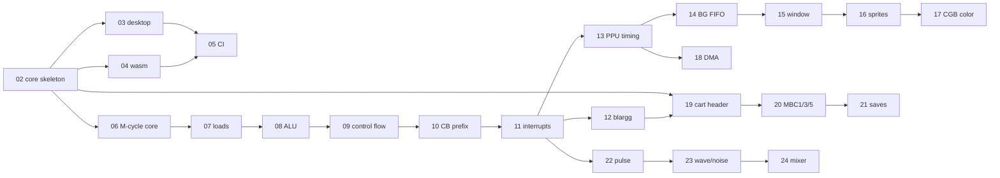

# rustboy-color — Delivery plan

How the work is cut into pull requests, what each one has to prove before it
merges, and in what order they unblock each other.

Companion to [`architecture.md`](architecture.md), which holds the *what* and
*why*. This document holds the *when* and *in what order*.

---

## 1. Working agreement

### Branches

```
main                     always green, always builds on all three targets
├── feat/<area>-<thing>  a new capability
├── fix/<area>-<thing>   a bug fix
├── test/<thing>         test infrastructure only
├── perf/<thing>         no behaviour change
├── chore/<thing>        tooling, deps, CI
└── docs/<thing>         documentation only
```

### Commits

[Conventional Commits](https://www.conventionalcommits.org/), one logical
change each:

```
feat(cpu): implement the 8-bit ALU as M-cycle sequences
fix(ppu): stop the window latching WY mid-frame
test(cpu): add blargg cpu_instrs harness
docs(arch): record the tick-accurate timing decision
```

Scopes: `cpu` `ppu` `apu` `bus` `cart` `timer` `joypad` `desktop` `wasm` `ci`
`arch`.

### Pull requests

| Rule | Value |
|---|---|
| Target size | under ~400 changed lines |
| Hard ceiling | ~800 lines; past that, split |
| Merge strategy | squash — one commit per PR on `main` |
| `main` protection | must build on x86_64 + aarch64 + wasm32, tests green, clippy clean |
| Stacking | allowed, but say so in the description |

### Definition of done

A PR merges only when all of these hold:

- [ ] `cargo check --workspace --all-targets` passes
- [ ] `cargo test --workspace` passes
- [ ] `cargo clippy --workspace -- -D warnings` clean
- [ ] `cargo fmt --check` clean
- [ ] `cargo check -p rustboy-wasm --target wasm32-unknown-unknown` passes *(once PR-04 lands)*
- [ ] new hardware behaviour cites its Pan Docs section in a comment
- [ ] comments state hardware facts, not concepts — see the rule below
- [ ] the PR description says what a reviewer should look at hardest

### Comments

Concepts live in `architecture.md`; code comments state facts that cannot be
recovered by reading the code.

| Write a comment for | Don't |
|---|---|
| a hardware quirk (`F`'s low nibble is wired to zero) | restating what the signature says |
| a magic constant's origin (`A = 0x11` means CGB) | explaining a concept the doc already covers |
| a deliberate inaccuracy, with a `TODO` | ASCII diagrams that duplicate a mermaid one |

Anything documented in two places will disagree in two months.

---

### Cadence

I will say **"good PR checkpoint"** when a branch has a complete, reviewable
unit of work. You decide whether to cut it there. I never run `git` myself.

---

## 2. Milestones


Each milestone ends in something you can *see or hear*. That is deliberate —
it keeps a long project from feeling like six weeks of plumbing.

---

## 3. The pull requests

### M0 · Foundations

| PR | Branch | Scope | Done when |
|---|---|---|---|
| **01** | `docs/architecture-and-roadmap` | `README.md`, `.gitignore`, `rust-toolchain.toml`, `docs/` | reviewed; nothing to build |
| **02** | `feat/core-skeleton` | workspace `Cargo.toml` + `rustboy-core`: registers, bus decode, peripherals, PPU mode machine, `Emulator::run_frame`; opcode bodies `todo!()` | check, test, clippy, fmt all green |

### M1 · Hosts — *goal: a blank LCD on both platforms*

| PR | Branch | Scope | Done when |
|---|---|---|---|
| **03** | `feat/desktop-host` | winit window, `pixels` blit, keyboard mapping, frame pacing, cpal output stream | `cargo run` opens a window showing a blank LCD |
| **04** | `feat/wasm-host` | `wasm-bindgen` bindings, canvas `ImageData` blit, `<input type=file>` ROM loading, `build-web.sh` | same LCD in a browser tab |
| **05** | `ci/multi-target` | GitHub Actions: build + test on x86_64 and aarch64, `cargo check` for wasm32, clippy, fmt | CI green on `main` |

### M2 · CPU — *goal: blargg `cpu_instrs` passes*

| PR | Branch | Scope | Done when |
|---|---|---|---|
| **06** | `feat/cpu-mcycle-core` | `read8`/`write8`/`fetch8`/`push16`/`pop16` helpers that tick the bus, `Bus::testing()` | helpers tick exactly 4 T-cycles per access, proven by test |
| **07** | `feat/cpu-load-store` | the `LD` family: r/r, r/n, `(HL)`, 16-bit loads, `LD (nn),SP`, stack ops | opcode tests for each form |
| **08** | `feat/cpu-alu` | `ADD ADC SUB SBC AND XOR OR CP`, `INC DEC`, 16-bit `ADD HL`, `DAA`, `CPL`, `SCF`, `CCF` | flag behaviour tested per op, `DAA` against a truth table |
| **09** | `feat/cpu-control-flow` | `JP JR CALL RET RETI RST`, conditionals, the extra M-cycle a taken branch costs | timing test: taken vs not-taken differ by 4 T-cycles |
| **10** | `feat/cpu-cb-prefix` | all 256 `CB` opcodes: rotates, shifts, `SWAP`, `BIT`, `RES`, `SET` | exhaustive tests |
| **11** | `feat/interrupts-halt` | `IME`, the `EI` one-instruction delay, the 5 vectors, `HALT`, the HALT bug, `STOP` | interrupt dispatch is exactly 5 M-cycles |
| **12** | `test/blargg-harness` | serial-port capture, ROM test runner, `cpu_instrs` + `instr_timing` in CI | both ROMs report PASS |

> **The payoff PR is 12.** If `instr_timing` passes, the tick-accurate bet from
> `architecture.md` §4 has paid off and the CPU is done for good.

### M3 · PPU — *goal: a title screen draws*

| PR | Branch | Scope | Done when |
|---|---|---|---|
| **13** | `feat/ppu-timing` | mode 2/3/0/1 state machine, `LY`/`LYC`, `STAT` interrupt sources, VBlank IRQ | mode lengths and the 154x456 dot budget verified by test |
| **14** | `feat/ppu-bg-fifo` | 5-step background fetcher, background FIFO, tile data/map addressing, `SCX` fine-scroll discard | a tilemap renders |
| **15** | `feat/ppu-window` | `WX`/`WY`, the window's own line counter, mid-frame enable | window overlays correctly |
| **16** | `feat/ppu-sprites` | OAM scan, 10-per-line limit, sprite fetch stalls, priority, flips, 8x16 | sprites draw over/under background correctly |
| **17** | `feat/cgb-color` | `VBK`, `BCPS/BCPD`, `OCPS/OCPD`, attribute maps, per-tile palettes and priority | a CGB game shows correct colours |
| **18** | `feat/dma` | OAM DMA (`FF46`) and CGB HDMA/GDMA (`FF51-FF55`), including their timing | DMA cannot be read through, as on hardware |

### M4 · Cartridges — *goal: a real game boots*

| PR | Branch | Scope | Done when |
|---|---|---|---|
| **19** | `feat/cart-header` | header parse, checksum, MBC-none, error types | a 32 KiB ROM boots to its title screen |
| **20** | `feat/mbc1-3-5` | ROM/RAM banking, MBC1 mode select, MBC3 RTC, MBC5 9-bit banks | mooneye `emulator-only/mbc*` tests pass |
| **21** | `feat/battery-saves` | save RAM out of the core; file on desktop, `localStorage` on web | a save survives a reload on both hosts |

### M5 · Audio — *goal: sound*

| PR | Branch | Scope | Done when |
|---|---|---|---|
| **22** | `feat/apu-pulse` | channels 1 and 2: duty, length, envelope, sweep | a scale plays cleanly |
| **23** | `feat/apu-wave-noise` | channel 3 wave RAM, channel 4 LFSR noise | both channels audible and correct |
| **24** | `feat/apu-mixer` | frame sequencer, panning, master volume, resample to 48 kHz, host ring buffer | no clicks or drift over 10 minutes |

### M6 · Polish

| PR | Branch | Scope | Done when |
|---|---|---|---|
| **25** | `feat/double-speed` | `KEY1` speed switch; CPU at 8 MHz, PPU unchanged | CGB games that switch speed run correctly |
| **26** | `feat/save-states` | serialise the whole `Emulator`, on both hosts | state round-trips bit-exactly |
| **27** | `perf/frame-pacing` | audio-clock sync, frame skip, wasm `requestAnimationFrame` alignment | steady 59.7 Hz, no audio underruns |
| **28** | `feat/debug-overlay` | optional: tile viewer, register view, breakpoints, step | toggled with a hotkey |

---

## 4. Dependency graph



**The parallel branches:** cartridge work (19–21) only needs the bus, and audio
(22–24) only needs interrupts. Neither waits on the PPU. If the FIFO gets
frustrating, there is always another lane to switch to.

---

## 5. Suggested review focus per milestone

What a reviewer should actually look at, since "looks fine" is not a review:

| Milestone | Look hardest at |
|---|---|
| M0–M1 | that nothing platform-specific leaked into `rustboy-core` |
| M2 | cycle counts per opcode, and flag edge cases — `H` on `SBC`, `DAA` |
| M3 | mode 3 length, and anything that stalls the fetcher |
| M4 | bank-number masking; wrong masks fail silently and corrupt saves |
| M5 | the frame sequencer's 512 Hz divisions, and resampling drift |

---

## 6. Status

| | |
|---|---|
| Current branch | `main` |
| Last merged | *nothing yet* |
| Ready to cut | **PR-01** and **PR-02**, both complete in the working tree |

The workspace manifest cannot be separated from its only member — an empty
`members` list is not a valid workspace — so `Cargo.toml` moved from PR-01 to
PR-02, and PR-01 is docs and tooling only.

### PR-01 `docs/architecture-and-roadmap`

```
README.md  .gitignore  rust-toolchain.toml
docs/architecture.md  docs/roadmap.md
```

### PR-02 `feat/core-skeleton`

```
Cargo.toml
crates/rustboy-core/Cargo.toml
crates/rustboy-core/src/
  lib.rs  emulator.rs  bus.rs  timer.rs  joypad.rs  serial.rs
  cpu/{mod,registers,exec}.rs
  cartridge/{mod,header,mbc}.rs
  ppu/{mod,fetcher,fifo,oam}.rs
  apu/mod.rs
```

Verified on this tree:

| Gate | Result |
|---|---|
| `cargo check --workspace --all-targets` | pass |
| `cargo test --workspace` | 21 passed, 0 failed |
| `cargo clippy --workspace --all-targets -- -D warnings` | clean |
| `cargo fmt --check` | clean |

What is real and what is deferred:

| Real now | `todo!()` until |
|---|---|
| register file, flags, `AF` masking | opcode table — PR-07..10 |
| bus address decode, echo RAM, I/O dispatch | mapper banking — PR-20 |
| M-cycle `read8`/`write8`/`push16`/`pop16` | fetcher, FIFO, sprite scan — PR-14..16 |
| interrupt dispatch, `EI` delay | APU synthesis — PR-22..24 |
| timer falling-edge, joypad matrix | OAM DMA / HDMA — PR-18 |
| PPU mode machine, LY/LYC, STAT, VBlank | |
| cartridge header parse, `Bus::testing()` | |
